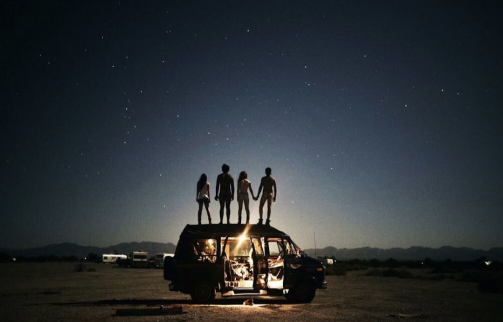
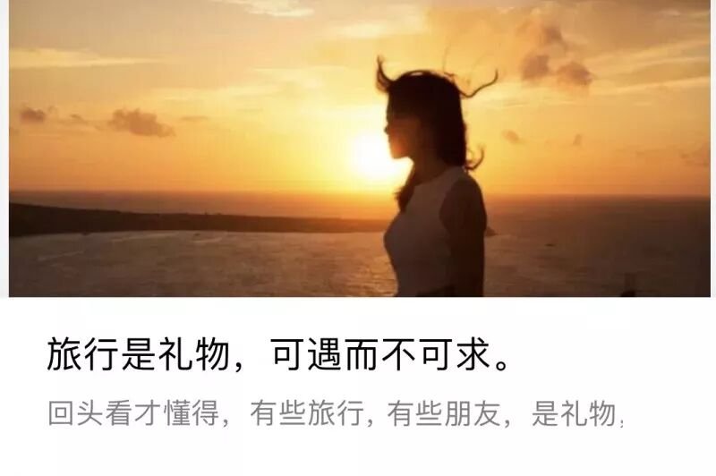
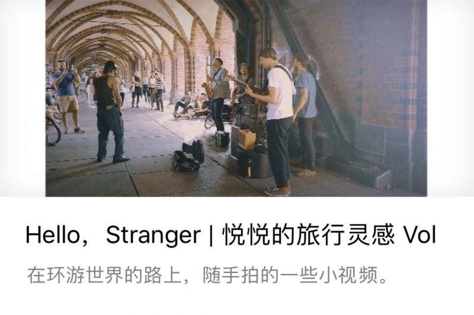
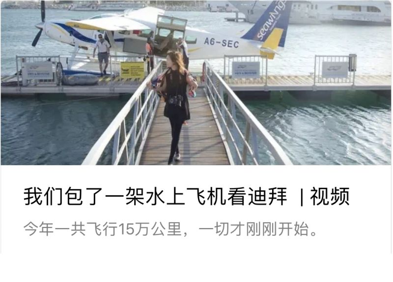
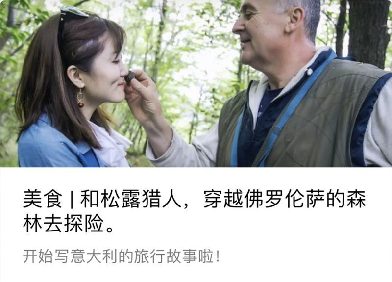
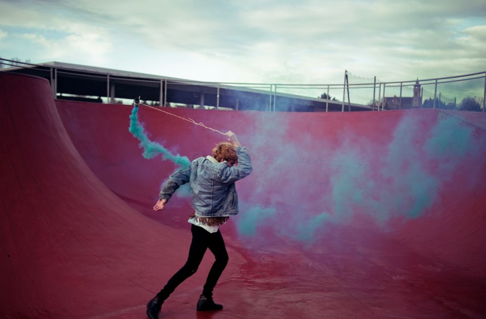
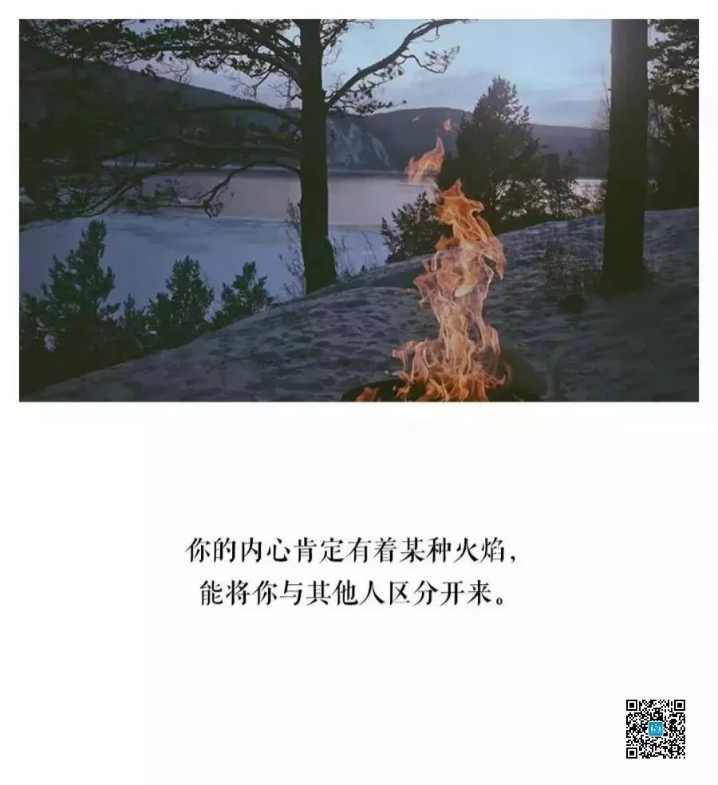
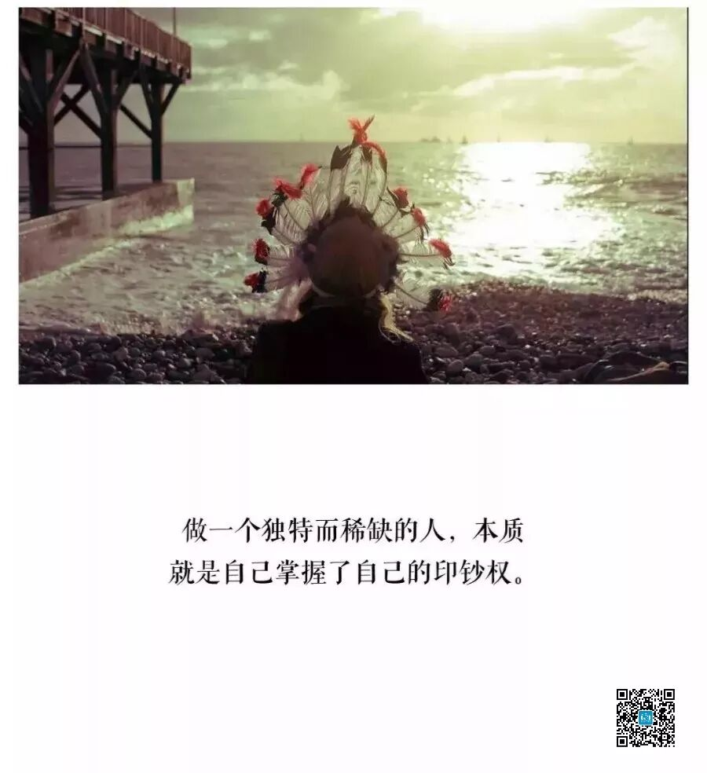
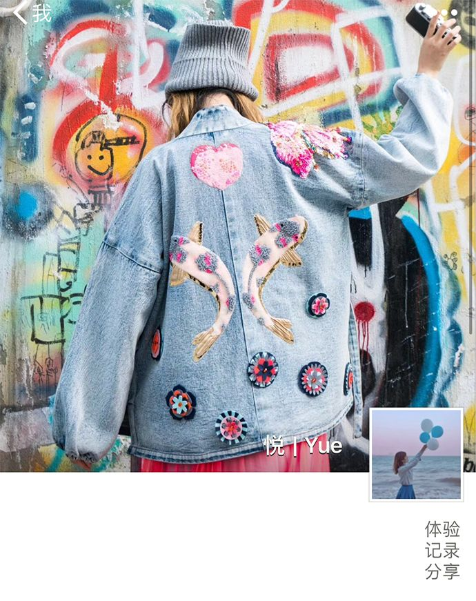
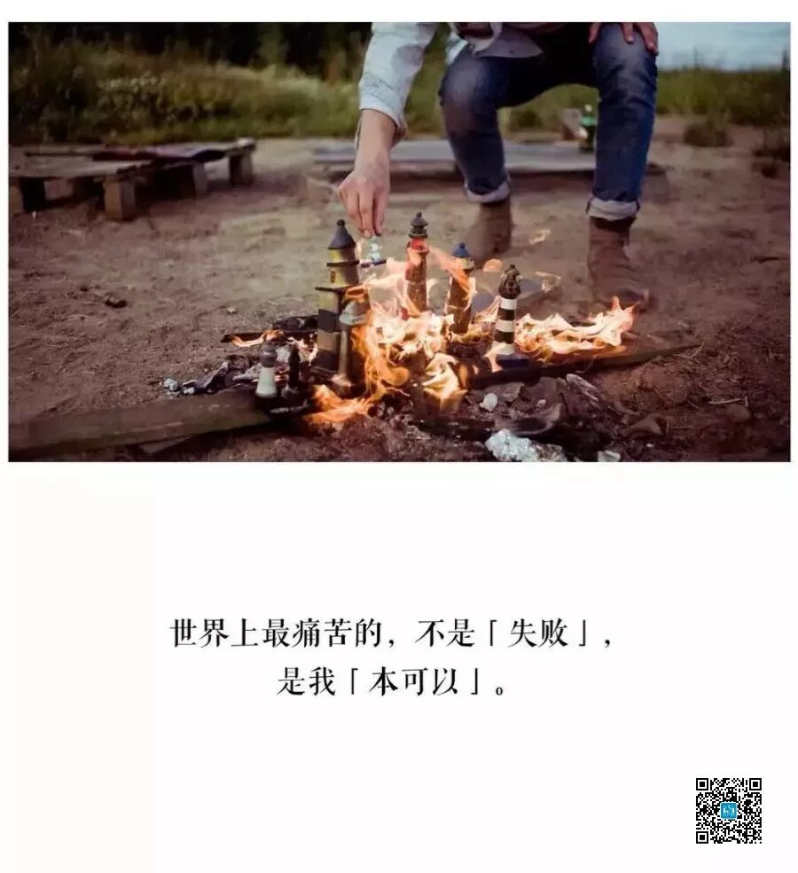

# How I Found a Job That's Cool, Fierce, and Deeply Loved

*Geng Yue · Brand Stories*

Hello, I'm Yue. This is an article I've been wanting to write for a long time — full of positive energy and hidden treasures.

Simply put, **I turned everyone's dream of traveling the world into my daily work**.

I'm sharing, for the first time, how it happened and the practical methods I discovered along the way. About 3,556 words, a 9-minute read.

**If you're tired of life standing still,** promise me you'll read to the end. We need to ignite a fire.

### 01 The Spark

I cried today, because I read **a real diary entry**.

It was one I wrote years ago in my office. That day, a thought stirred in my heart — I realized there might exist, somewhere in this world, an **Amazing Job. A job that's cool and fierce.**

Photo/Theo

201X, December 23rd, Night

Working late at the magazine. For this issue's cover story, I found photos by a French photographer named Theo. A twenty-year-old, photographing his friends, traveling everywhere, living freely.

I suddenly realized — this is not the life I want.

I like my job, but I'm exhausted, and there's not much sense of accomplishment. One day I posted eight Weibo updates, visible only to myself, each one saying the same thing: **I want to quit.**

But after the thought faded, the dark weight of work pressed down again. **I kept breathing the smog, fainting in the office, tears falling on the keyboard. My twenties, day after day, trapped in a tower of glass.**

- The life I wanted was one of wandering, of moving through the world.
- Stepping into foreign lands, living there for a while. Meeting extraordinary souls, drawing inspiration and nourishment to enrich my own life.

Not just sitting behind a computer, reading dry emails, digging through research, editing stories, collecting beautiful photos from around the world.

**I wanted to truly walk into those images.** To record, to see, to experience. To melt into the bustling streets of foreign cities, to lie by the sea, inside the landscape.

Chinese young people live too bitterly. Not cool at all.

**I wanted to live a cool life.**

But how? As a journalist conducting interviews? As a photographer? Maybe I needed some particular skill...

**If I could live like that, it would be truly magnificent. How could I get closer to that kind of life?**

That night was like any other. I sat through it fully clothed, closed my laptop, and walked out of the office building. I've seen this city's dawn countless times.

The city hadn't yet awakened. The sky hadn't fully brightened. Everything was still in chaos, unformed. But a tiny flame kindled in my heart. I told myself: **Wake up.**

### 02 JUSTGO

Unrealistic. Wishful thinking. The person I cared about told me this directly over the phone.

I stayed silent. But that fire couldn't be extinguished... In the next year or two, I made that Amazing Job a reality.

On the road, I met the person I had once most wanted to become. And I realized — this is the life I wanted.

- I shed the armor and heavy shell the urban world had pressed onto me. I became vibrant, humorous, joyful — as if reborn.
- I embraced challenges to document my journeys. **And I earned money through what I love, through my talent and skills.** It was hard work, but deeply worthwhile.

After finding my true calling, something miraculous happened — the excitement, the sense of value, the meaning, **the calling of a mission, the release of life's energy** that my old job could never provide — all of it descended upon me. Effortless and natural.

**My soul came back to me.**

### 03 Finding the Fire

The secret I most want to share from this journey is **how to find the Trigger — the spark that sets you ablaze.**

While writing this, I was listening to a lecture by Liang Ning, the brilliant mind from Zhongguancun. She said something I love:

When the universe arranges a person's destiny — or gives them a mission — it actually gives them a passion. **A genuine love. Something called an "addiction."**

Simply put: **the thing you never tire of doing, the thing you'd do forever — that is where your gift lies.**

Any job consumes you. **What remains after the grind, the enthusiasm that still sustains you — that is true love.** Isn't creating and working on the road hard? Very hard. But **my body is tired, not my heart.**

You endure the monotonous, grueling practice. You are drawn out into the best version of yourself. You keep refining, never satisfied, wanting to push something to its absolute limit.

This addiction switch — often, it's ignited by a single chance encounter.

### 04 Fit Matters More

Many people suffer from knowledge anxiety, buying course after course, desperate to improve. But in your career, **finding your "ecological niche" matters more.**

It's like trying to download a multi-gigabyte file on a 1MB connection — a painful struggle. But find a 100MB connection, and it finishes in seconds.

This world has far more than 360 trades. Everyone has a different personality, starting point, and texture. China's market is brimming with shifting opportunities — you need to choose with sensitivity and wisdom.

Stubbornly grinding away, ramming your head against a wall, insisting on the impossible — it's a challenge, yes, but not wisdom. **Cut your losses in time. Go with the flow. Effort is just one point of diligence. You must choose the rising currents, the momentum, the broader direction — only then can you leap upward with the tide.** (Liang Ning)

### 05 How to Find It

I used a rather clumsy method — **process of elimination**. Take it for what it's worth.

- Put everything you're interested in into one big circle
- Try them one by one
- When something doesn't feel right, cross it out. Try again. Keep searching.
- The circle gets smaller and smaller. **The center that remains — that's basically your answer.**

I tried every corner of the media world: copywriting, marketing, advertising, websites, apps, new media, topic selection, planning, photography, writing, video, layout, management...

Only at the end did I confirm that what I most wanted to do was create content. I used the same method for travel.

This process is frustrating and slow. It doesn't 100% guarantee you'll touch what you love. But at the very least, you'll know what you don't want.

### 06 If You Can't Find It

You might wonder: what if I try and still can't find it?

If you never find it, then just keep living. When you can't see the light, **focus on doing well whatever is in your hands today.** You might think it's trivial and meaningless — but the time you invest in it is real.

Some say: I don't really want to do anything, I just want to lazily scroll through my phone. **I think: if I had money, I wouldn't need to work. But you still need to find your own value, your scarcity.** Ask yourself — what makes you worth that much? Let the market test your core competence. And when you're still young, there's no need to set limits or draw conclusions too early.

### 07 Take Out a Blank Sheet of Paper

If you want to keep searching, here's the second method I tried.

- Take out a blank sheet of paper. Turn off your phone. Give yourself two quiet hours.
- At the very top center of the page, write: **"What am I living for in this life?"**
- Write down the first word that comes to mind. Just write. No taboos.
- Facing that sentence, ask yourself: if I achieve this goal, "then what?"
- Soon, you might feel there's something else more important. If so, cross out that sentence and write the next, more important one. This word can be an extension of the last, or something entirely new.
- Keep repeating. Cross out, rewrite. Cross out, rewrite.
- **Until you write a sentence that truly touches the core of your being. And you cry.** That sentence is your life's purpose.

I tried this several times, always giving up halfway. Once, near the end, I didn't cry — but **what made me stop writing were three words: "experience, record, and share."**

These words have been my WeChat signature ever since.

After you find it, you need **the ability to match it (this is critically important).**

### 08 Try Something New, Be Bold

Do you still feel a restless ache in the quiet hours of the night? Have you, through hesitation after hesitation, burned through time and let opportunities slip away?

I too spent far too long dithering, cowering, suppressing myself. **Then — a single spark, a flame, one path walked to its end — I found myself.** Finding it doesn't mean smooth sailing forever. Time, luck, and momentum keep shifting. You'll face new challenges, solve new problems, confront mountain after mountain, moving them stone by stone...

But you will never, ever regret not having tried, not having given it your all. You won't have to console yourself in old age with: ah, **when I was young, there was something I wanted to do, but I didn't do it, and I've regretted it for half my life.**

Text / Yue

Photo / Theo