# 🚢 “完美假日·墨西哥站”在纽约揭幕，皇家加勒比如何重构未来的度假方式？

*耿悦 · Brand Stories*

---

全球最大游轮品牌皇家加勒比，近日在纽约揭幕其有史以来最宏大、最具开创性的专属目的地项目——“完美假日·墨西哥站”（Perfect Day at Mexico）。

这座位于墨西哥科斯塔玛雅港口旁的岛屿，占地超过200英亩（约81公顷），预计将于2027年9月开放，设计承载能力约2万名游客。

作为“完美假日”系列的最新一站，它被皇家加勒比视为“皇冠明珠”，也成为本次全球发布会的绝对主角。

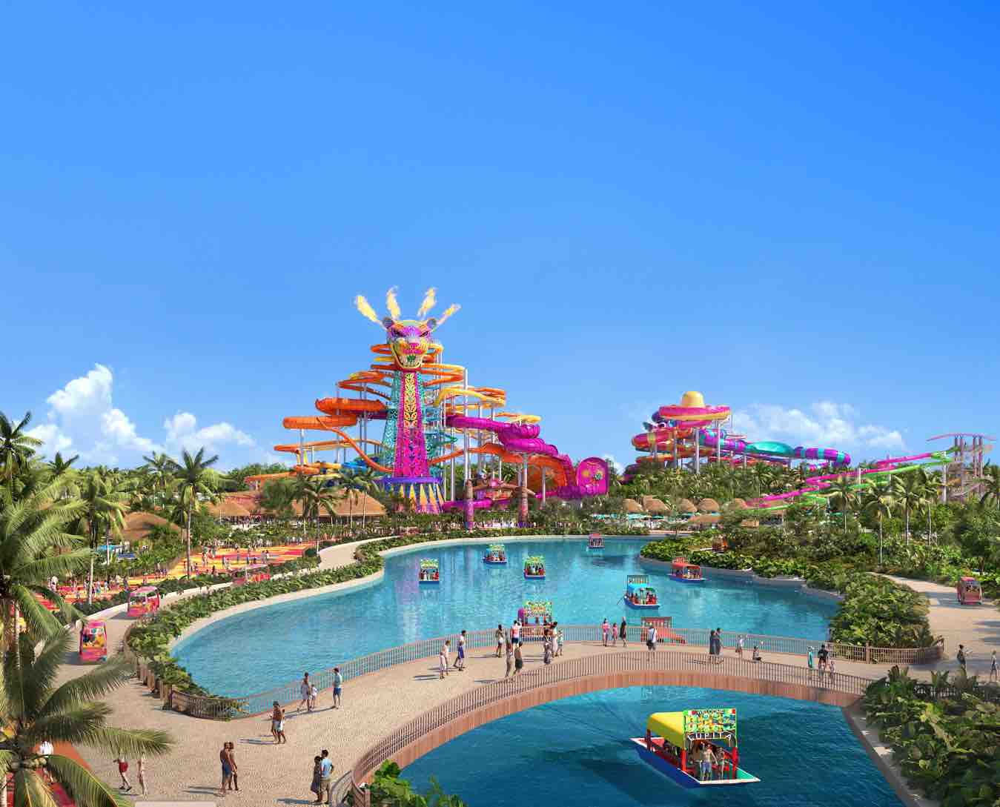

我有幸亲临纽约曼哈顿59号码头，与来自世界各地的旅行行业伙伴们，共同见证了皇家加勒比对这座岛屿的未来愿景。

当听完他们的整体设计，对这座岛屿的期待值已被彻底拉满。

它不仅是皇家加勒比历史上最宏大、最具开创性的度假项目，

也重新定义了“未来海岛假期”的行业标准。

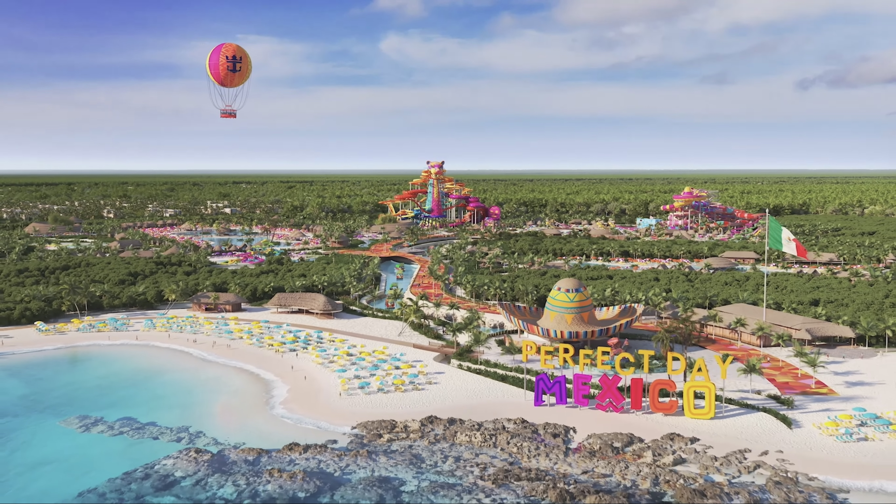

> “在过去50年里，我们持续打破人们对游轮旅行的刻板印象，转型为面向全龄层的全球度假品牌。
> 
> ‘墨西哥完美假日’不仅延续了我们的创意精神，更是对目的地体验的一次系统性重构。”

皇家加勒比国际游轮全球总裁兼首席执行官迈克·贝勒（Michael Bayley）在现场说道。

这个目的地为何如此与众不同？

它将如何做到既梦幻又具体，既狂欢又贴心？

接下来，我们将迫不及待和你分享这一切，

全面细致地拆解这场属于未来的梦幻假期。

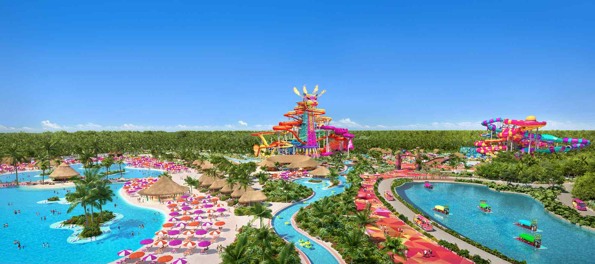

**巨型乐园：**

**为全龄旅行者打造的沉浸式王国**

不同于传统的游轮停靠站，“墨西哥完美假日”被设定为一个全天候、沉浸式、多主题的乐园级体验系统。
内部划分为七大主题社区，涵盖从刺激冒险、悠闲漂流、家庭共享、成人私享，到本地风情沉浸等多种层级。

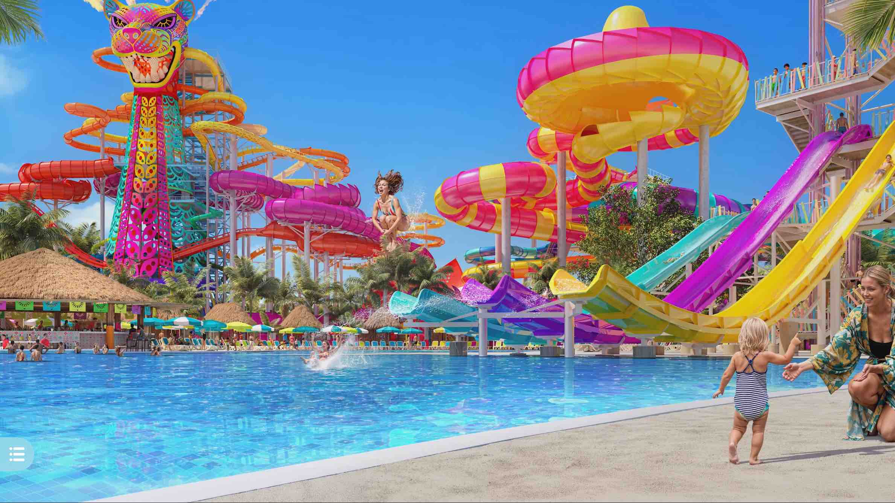

**豪气改造**

“Perfect Day at Mexico”所坐落的位置，原本是墨西哥加勒比沿岸的 Costa Maya 港口。

皇家加勒比购入了 Costa Maya 港口旁的一片专属海岸，这不是租，也不是合作，

而是实打实地买下了这片海岸线，只为把它改造成皇家加勒比宾客专属的全沉浸目的地。

其他游轮公司仍可停靠 Costa Maya，却无法踏入这个即将出现的假日岛屿——它的入口，只为一群将梦想化为现实的旅行者而开。

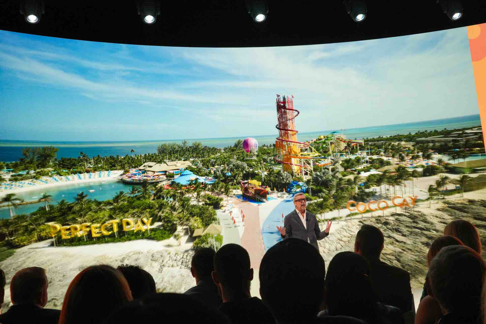

**Coco岛体验升级**

这是一个超级巨型的度假乐园——不仅仅是刺激项目多，而是“全龄覆盖 + 高密度娱乐 + 景观体验”三位一体的构建。
该项目将进一步拉开皇家加勒比在专属目的地领域的产品矩阵，与已有的“可可岛完美假日”一南一北呼应，形成加勒比双核布局。

他们不仅带来了在“可可岛”成功实践过的一切，还加入了更多前所未有的元素，

形成一座体验全面升级、绝对奇幻的水上王国。
这份惊喜正在揭晓。

1. **Loco Waterpark**

为水上狂热者而生的能量爆发区。

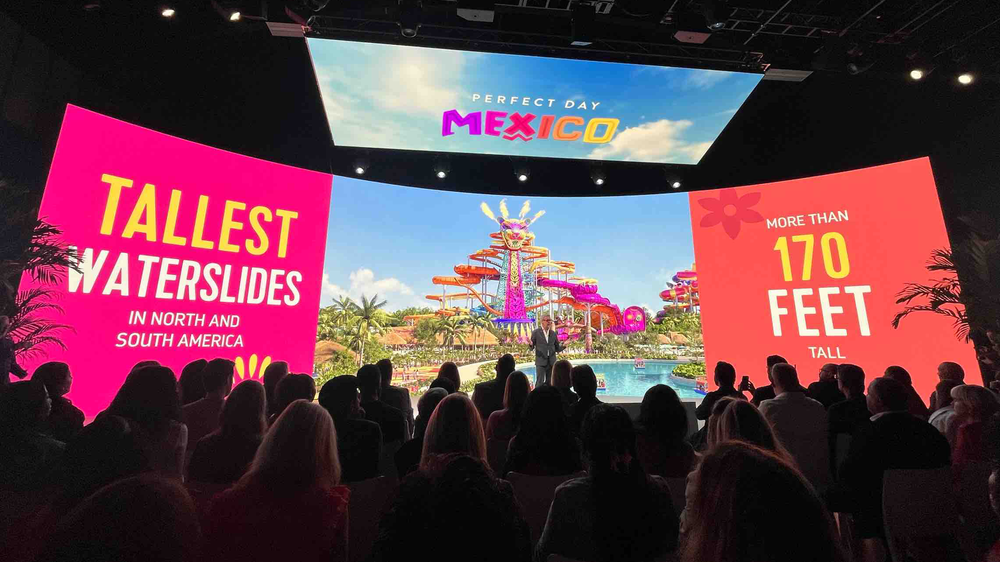

从“Jaguar's Peak”开始，这是目前北美与南美最高的滑道塔，总高度约170英尺（约52米），顶部装饰有一座美洲豹雕塑，

它的主滑道时长为2分15秒——这一时长在水滑道中属于罕见，普通滑道通常在几秒内就结束了。

而你会在这两分钟里穿越盘旋、漂移与飞跃，感受心跳加速的极限快感。

> “我们希望吓他们一跳，当然，不是太吓，但我们希望让每个孩子都带着一点紧张、很多兴奋，
> 
> 走进 Jaguar's Peak——它绝对会成为他们记忆中最疯狂的一次体验。”
> 
> ——迈克·贝勒（Michael Bayley）

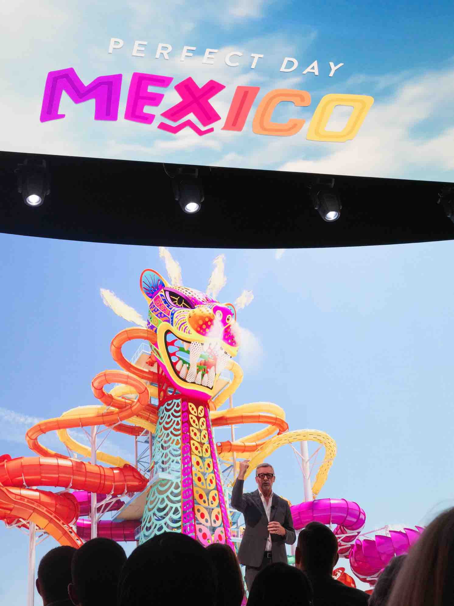

这座滑道塔不只是为“极限”而生。

它的外形和命名，来自一次面向儿童的创意工作坊。

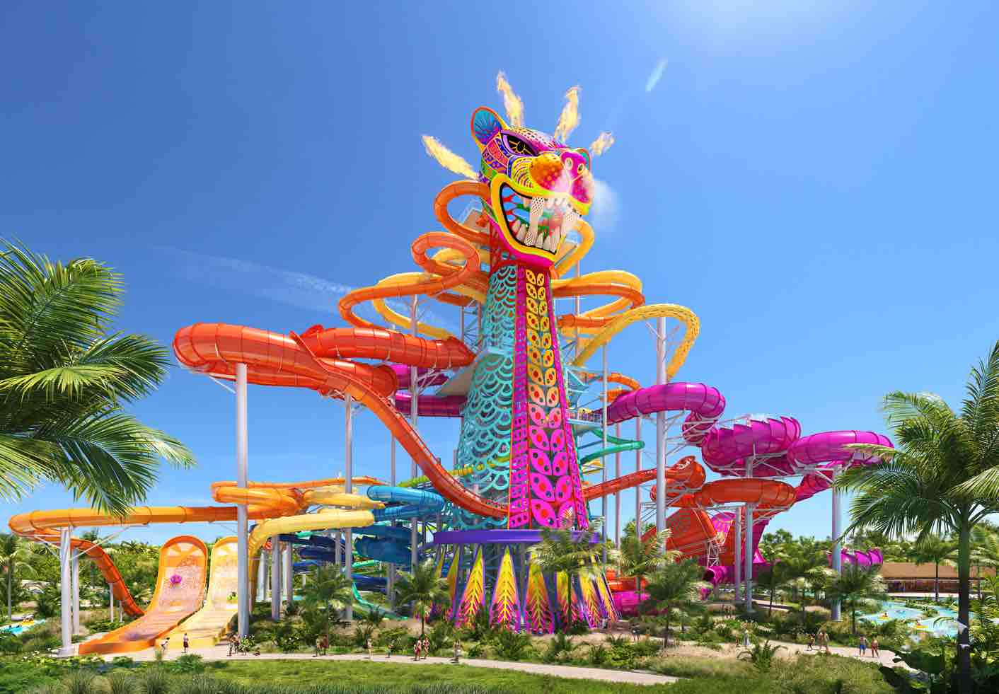

孩子们画出了各种奇幻动物，从蛇头到猴子，从图腾到天马行空。

最终，那只威严又神秘的“Jaguar”赢得了投票，那是他们心中“英雄”的具象化。

“Loco Waterpark”的整体规模，相当于4个足球场，项目密度之高在整个加勒比区域亦属罕见。

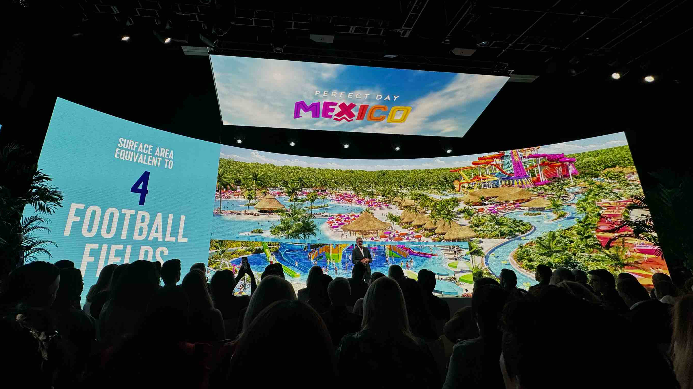

> “我们的秘诀其实没那么神秘。
> 
> 我们始终把宾客放在最核心的位置。
> 
> “这意味着，我们不是为CEO、高管设计假期，而是邀请真正的家庭，从一开始就参与设计。”
> 
> ——皇家加勒比首席产品创新官杰伊·施耐德（Jay Schneider）在现场坦言。”

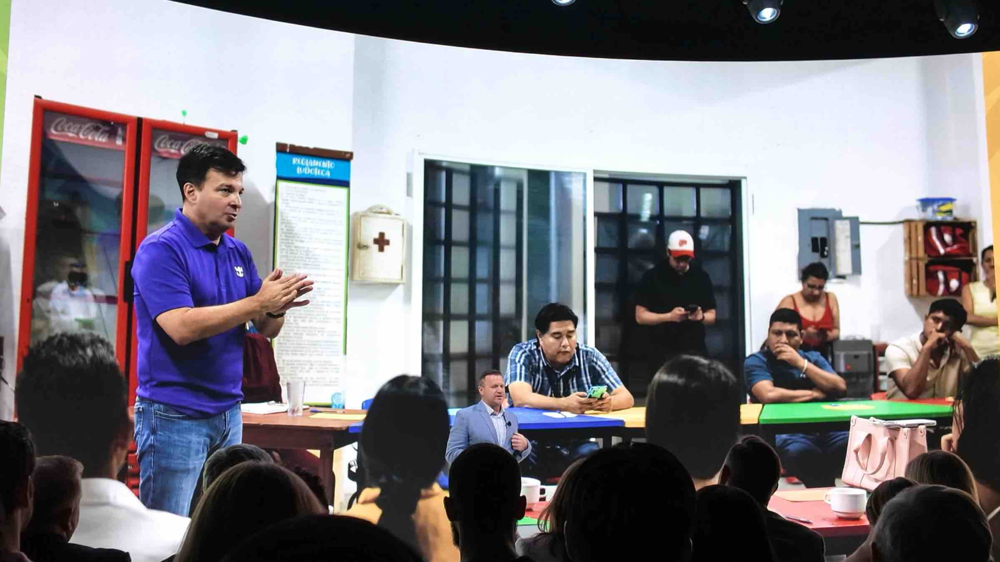

一个真正好的目的地，不只在于它有多高、有多快，而在于你是否记得它叫什么、长什么样

——你是否在那一刻，和家人一起，创造了共同铭记的记忆。

**滑道王炸礼包组合**

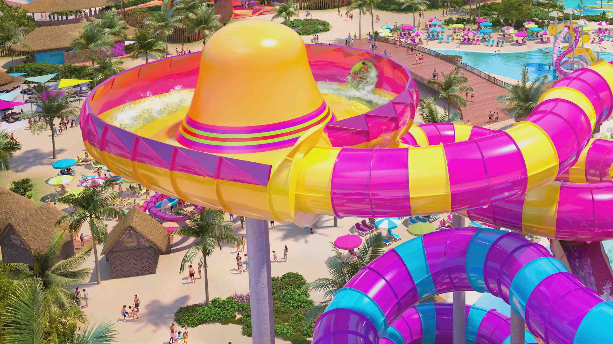

除了主塔，这里还有几组皇家加勒比至今最惊人的水滑道设计：

**世界首个 Sombrero 滑道：**

造型来自墨西哥传统草帽，滑道环绕帽檐高速盘旋，最后冲入滑道系统中一座“玛格丽塔杯”造型的水池

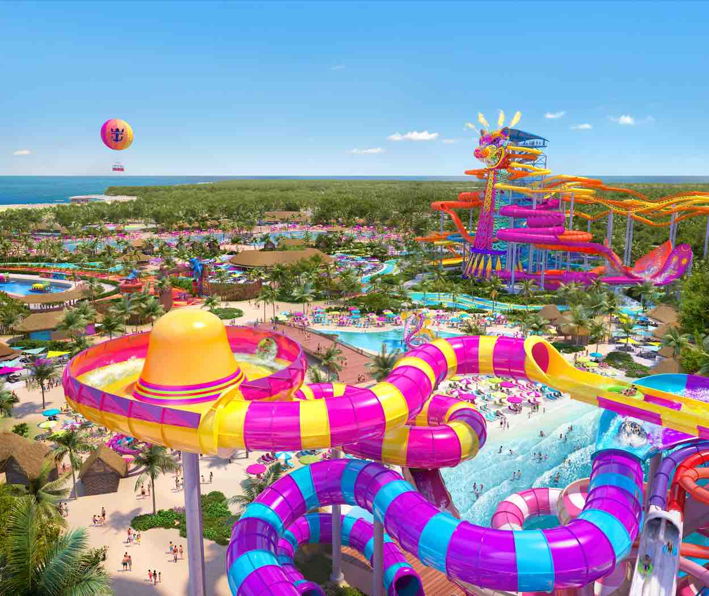

——这是官方称为“Tipsy Sombrero”的大胆创意，整个设计融合了墨西哥艺术家与建筑师的幻想与幽默感。

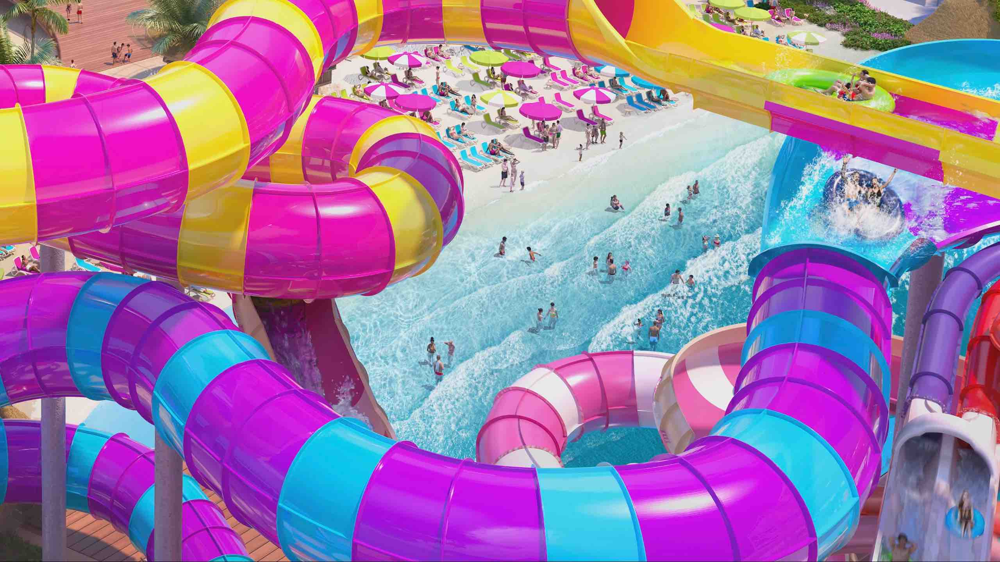

**HydroPlunge 弹射滑道：**

被水平发射后飞跃出滑道，划出长达40英尺的抛物线，溅入水中。
而落水点正好设在一个泳池酒吧旁

——你的朋友可以边喝玛格丽塔，边看你腾空入水，成为“喝彩现场”的焦点。

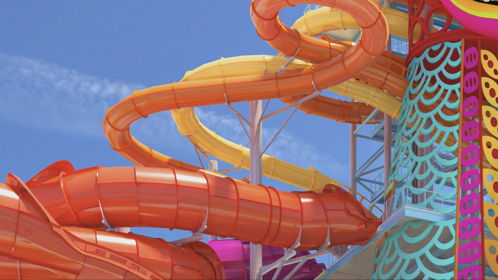

**北美最高的家庭筏式滑道：**

最多容纳六人同时出发，适合家庭并肩挑战高速水浪；
世界最长竞速滑道：数条平行滑道交错盘旋，专为竞技与拍照而设；

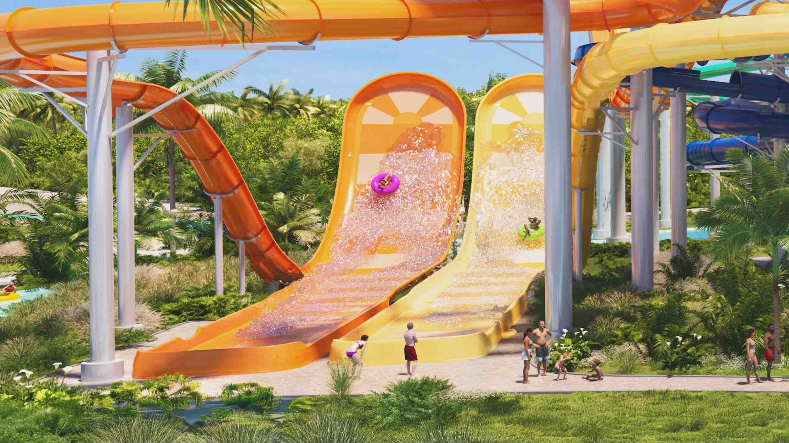

**观景互动滑道：**

所有滑道与观景平台错落交织，不仅能拍下最帅的出发，也方便围观滑行全过程，是“晒图”和“尖叫”的最佳舞台。

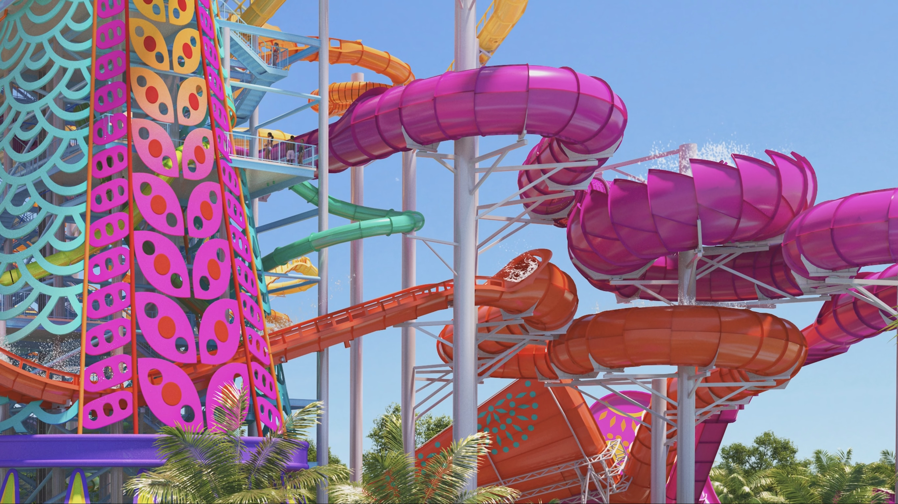

每一条滑道都是能“让你愿意放下手机、全身心投入”的释放系统。

每一条都经过精心设计，是全新的、颠覆性的体验。

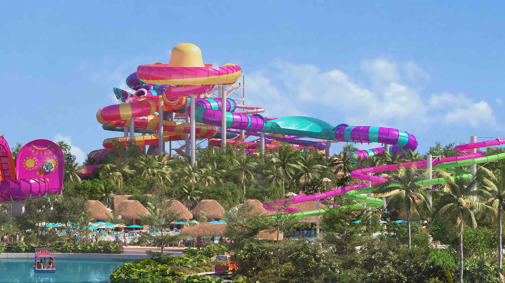

**嬉水湾（Splash Cove）**

**Splashaway Bay**

**孩子的水花王国，家长的安心据点**

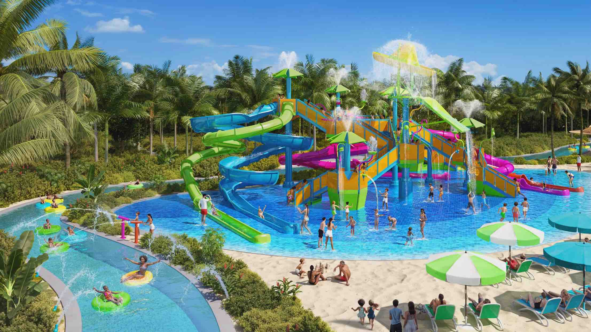

这是皇家加勒比历史上规模最大的 Splashaway Bay，

为6岁以下的孩子打造了一座真正属于他们的水上城堡。

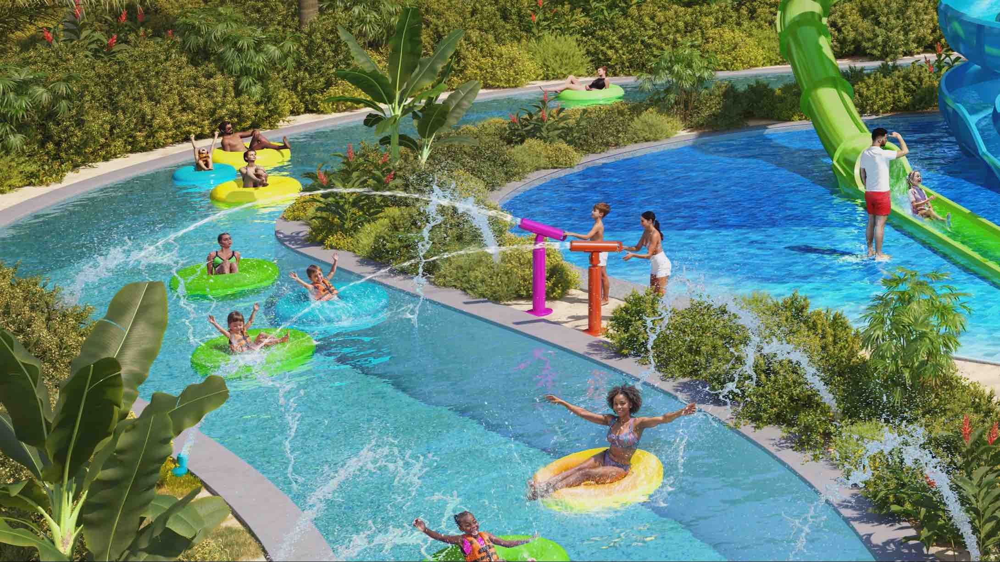

泡泡池、互动水墙、小滑道塔、喷射装置......这里是他们跑动、尖叫、泼水、翻滚的主舞台。

而这个区域，真正聪明的地方，是它也考虑到了家长的视角。
不是“把孩子交给水”，而是让父母有地方坐、有饮品、有遮阳，同时还能清楚看到他从哪里滑下、在哪里落水。

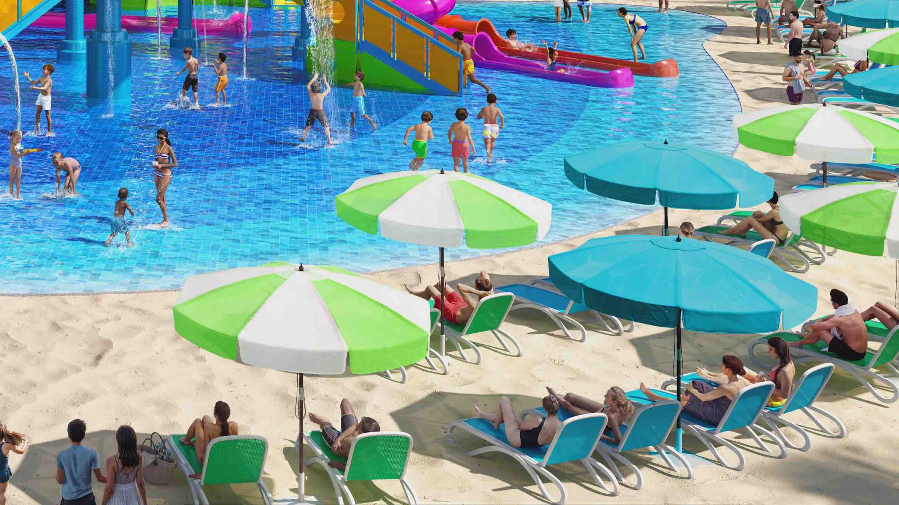

**Splash Summit**

作为过渡区，为年龄稍大的孩子提供更高一级的挑战，滑道层级拉高，但依旧保持开放可视的设计。
全区域围绕“空间分离 + 视线连通”进行布置，软质地面、避光动线、洗浴与通行通道全部重新梳理。

杰伊·施耐德（Jay Schneider）在现场说：

> “我们从可可岛学到的一点是——孩子能连续滑100次，但父母只想有个能看着的地方。”

于是，这一整片亲子区的设计，落点只有一句话：你不必陪着滑，但可以一直看见。

**Crazy Lazy River｜懒人河**

**水上漂流的浮动客厅**

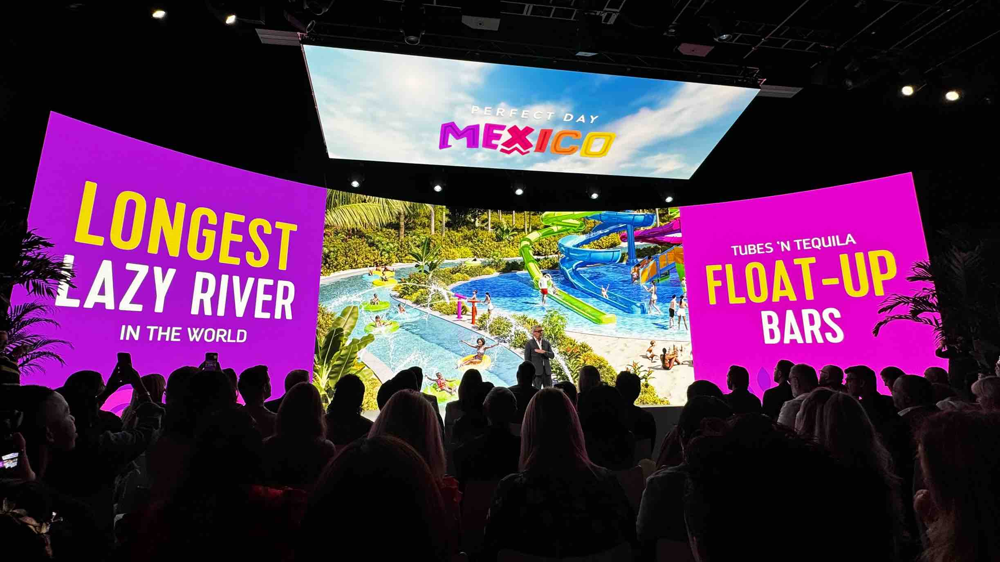

这将是**全球最长的懒人河**，全程漂流预计长达 54分钟，

> 但“你可以随时上岸，也可以一整天都泡在里面。
> 
> 让你能带着龙舌兰和你喜欢的饮料，轻松地漂浮。”

游客可以携酒入河，边漂边喝。

更绝的是，河道沿途设置了数个“绿洲酒吧”，你可以随时划桨靠岸，进入一个有现场音乐和聚会氛围的小酒馆，喝完一杯，再继续漂流。

> “如果你愿意，你可以在这条河里泡上一整天。”

此外，他们还设置了“Crazy Zone 疯狂支线”——水流会突然加速、制造波浪，非常适合寻求刺激的挑战者。
主河道之外，还包含多个进出口，可与 Cabana 无缝衔接，真正实现“从小屋漂出去，再漂回来”。

这是一条真正可以“待上一整天”的水上动线，皇家加勒比称之为“**Floating Lounge（浮动客厅）。**”

**Chill. Thrill.**

然后是你自己的节奏。

在“完美假日·墨西哥站”的规划图上，你不会看到“功能区一”“动线二”这样的术语。
取而代之的，是两个更具情绪维度的词汇：**Thrill 与 Chill。**

这座岛屿完全不是让你“打卡的项目”，

而是鼓励你跟随身体与情绪，在刺激与放松之间，自由地找到自己的节奏。

特别是对于家庭旅行者而言，他们既渴望畅快游玩，也期待真正放松。

正如迈克·贝勒（Michael Bayley）所说：

> “我们的宾客从六个月到106岁不等，我们努力让每位宾客都能拥有自己的专属时光，无论是全家同行，还是独自前来。”

2. **Chill Island：**

**南北休闲海滩，什么也不做的权利**

Chill Island 是“完美假日·墨西哥站”中最长的一段自然沙滩。
南北双沙滩结构，环抱整个岛屿正面，总长近 2 英里。

没有打卡任务，也没有游玩路线。

这里是“什么都不做”的专属地带。

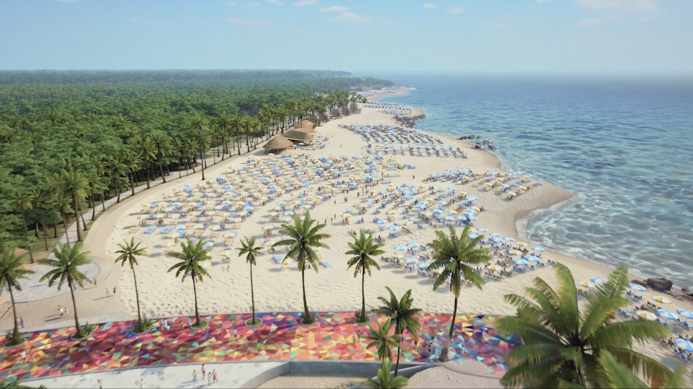

北滩适合聊天、走动、听音乐。

南滩更安静，适合带孩子玩沙，或一个人看海发呆。

整片沙滩都有足够多的：免费躺椅、饮水站、小吃亭、遮阳伞和柔软的沙子。

你只需要一条毛巾、一杯饮品，以及一个没有安排的下午。

这是为“放空”而设的空间，每一秒都可以慢下来。

杰伊·施耐德（Jay Schneider）在现场说：

> “Chill 对我们每位客人来说都不一样，有人想听加勒比音乐，有人想泡在水边，有人只想脚踩白沙、举杯发呆。”

而在这里，每一种“Chill”的定义，都会被认真对待。

3. **Costa Beach Club：**

**更安静、更高端的奢华私岛**

如果说 Chill Island 是“自由放空”的白沙海岸，

那么 Costa Beach Club 则是“奢华沉浸式放松”的另一种打开方式。

这是岛上唯一一个需付费进入的高端静区，

专为高净值旅客打造的静谧空间。

这里没有喧哗的派对，也没有孩子们的追逐打闹，

取而代之的是一整套近乎隐秘而高质的放松体验：

恒温无边泳池：面朝加勒比海，水天一色，不设边界；
正餐级别餐厅：配套服务员点单系统，全程送餐，饮品随叫随到；
新一代 Cabana 小屋：
配有独立冷藏系统、管家服务与独立浴室；
私人甲板、阳伞与双人日光床，一切为“放松”而设；
部分配有专属小泳池，宾客无需离开 Cabana，就能尽览海岸风光。

这是 “Chill” 的最高级表达。

不为社交，只为被照顾，是那些真正懂得如何享受“安静权利”的旅客的理想场域，也是一种“精致不喧哗”的生活方式。

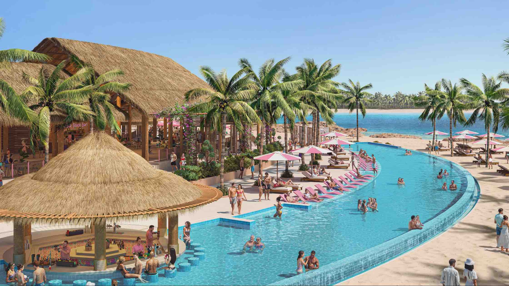

4. **El Hideaway：隐世海滩**

**18+ 限定的成人欢聚区**

如果说 Costa 是岛屿的“静脉”，

那 El Hideaway 就是它的“动脉”。

这是专为成年人打造的专属派对海湾，18 岁以上限定进入，

彻底隔绝孩子们的嘈杂与干扰。

在这里，你可以选择跳进水里解压忘我，

也可以约上朋友庆生狂欢，自己决定怎么玩。

大型无边泳池：设有水中酒吧与浅水舞池，适合一边畅饮一边跳舞；
现场音乐与常驻 DJ：日落不落，节奏不停；
Ultimate Party Cabana：可容纳 20 人，配有私人泳池、冰桶、音响系统与专属通道，专为庆生、单身派对等庆典定制；
全天候酒吧服务：随时举杯，随时欢聚。

正如杰伊·施耐德（Jay Schneider）在现场所说：

> “它喧闹、它放肆、它不适合所有人——而这正是它的意义所在。”

这是属于大人的自由王国，

也是自由节奏真正被放飞的地方。

**Fiesta Plaza：纽约沉浸式体验，岛屿提前降落**

在发布会之后，紫色灯光投射在59号码头的迎宾通道里，音乐鼓点流动。
纽约变成了加勒比。
派对开始。

马里亚奇乐队穿着银扣饰边的传统制服，在灯光后现身，铜管乐器奏出热烈节拍。
它不仅是一场节日派对的舞台，更是一场关于“Perfect Day at Mexico”真实体验的提前预演。

你在这里看到的色彩、灯光、节奏、美食，模拟了未来墨西哥岛屿的体验。

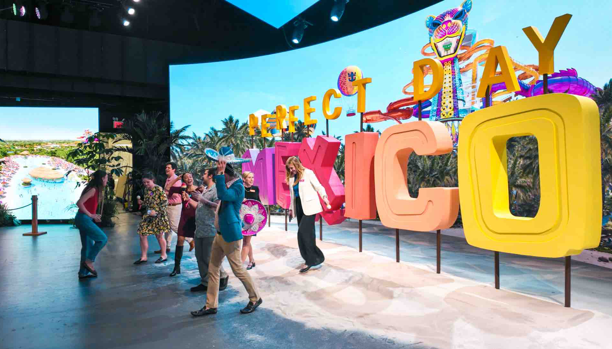

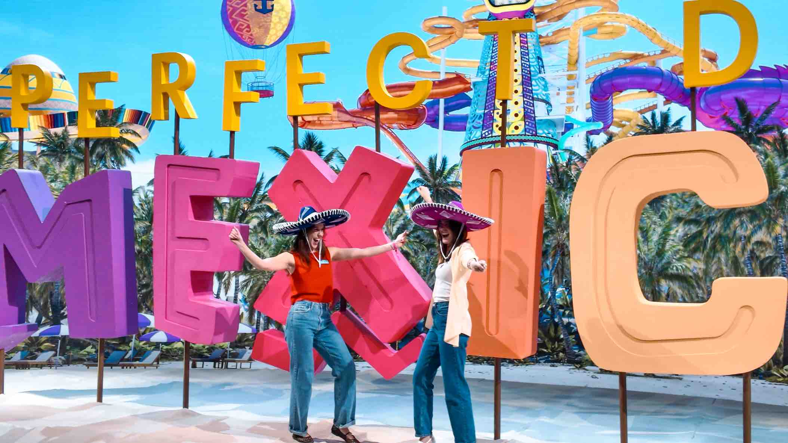

现场布置了大量可互动的巨型草帽，游客戴上它们拍照、旋转、互换，气氛轻松。

这个造型独特的“醉帽”原型，正是皇家加勒比与墨西哥艺术家联手打造的岛屿视觉锚点——Tipsy Sombrero Bar。
它不只是装饰，而是将节日精神“玩具化”的表达。

现场有很多有趣可爱的小摊点，重现了Fiesta Plaza中将出现的“River Market”：
数个摊位构成一个灵活可逛的环状街区，是目的地体验的“风味入口”。

快取小吃区提供了盐酥鸡、汉堡、沙拉、玉米片等街头小食风味；
本地工艺摊位可制作钥匙扣、调制辣酱、选配饰品，所有材料开放、无需排队；
所有食物与饮品免费，模拟了未来岛屿上“无须额外付费”的饮食体系；
调酒吧开放龙舌兰与玛格丽塔，自取自饮，自在畅饮。

摊位环绕，草帽飘动，味道和人流共同组成一场流动中的入境仪式。

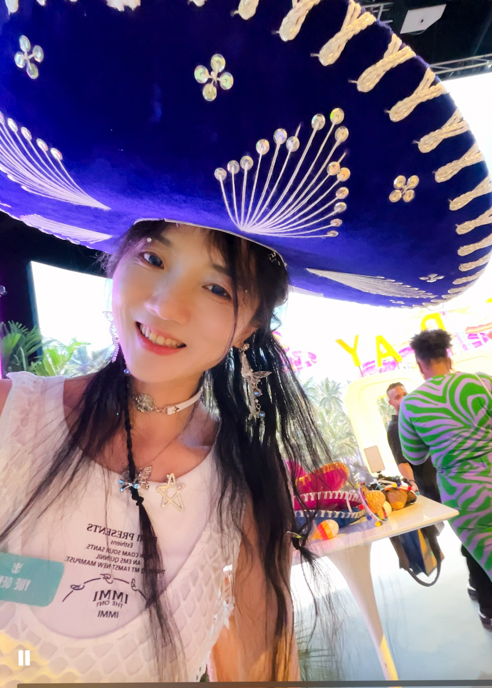

这一切并非刻意制造节奏，而是通过真实的“物”——草帽、酒杯、小吃、手作、管乐

——让你在纽约提前感受到墨西哥的节日精神，和完美假日的快乐氛围。

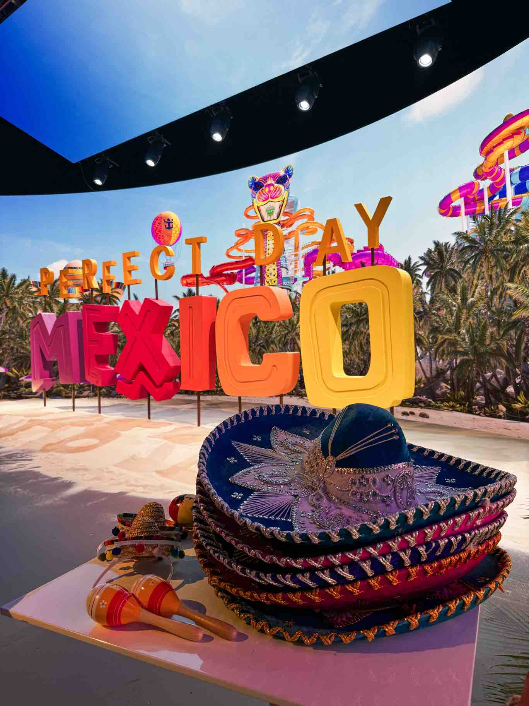

岛还未开放，它的生活方式已经抵达。

Fiesta Plaza，是未来“墨西哥完美假日”的第一站。

而今晚，它提前出现在了曼哈顿。

**Up & Away：热气球提前升空的心愿清单**

场地另一端，是皇家加勒比标志性项目“Up & Away”的沉浸式预演区。

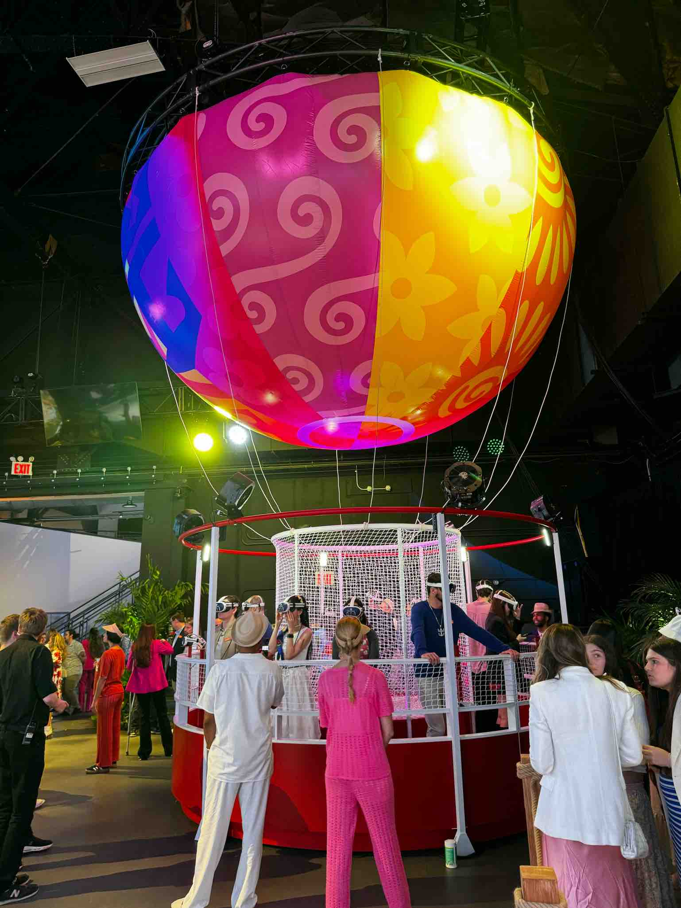

巨大的热气球模型高悬在59号码头的天幕下——

这是未来“完美假期·墨西哥站”中Up&Away的项目原型，也是登陆岛屿后能升空俯瞰加勒比的起点。

在现场有很多人想玩，我们就排队站进模拟舱，戴上VR眼镜，画面瞬间切换：

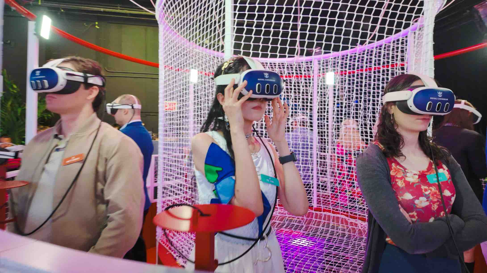

热气球从Quintana Roo州的海岸线缓缓升起，脚下是延展入海的白沙滩、湛蓝如镜的加勒比海，和即将开放的目的地岛屿原貌。
整个飞行不过几分钟，但景色栩栩如生，心中种下了一个渴望真实升空，俯瞰碧海白沙的梦想。

从模拟器里摘下头盔时，就种了草，“我真的想去一次”。

**Interview ｜专访皇家加勒比高级副总裁安吉·史蒂芬（Angie Stephen）**

**用一座游轮，连接三代人的旅行梦想**

在“墨西哥完美假日”发布现场，我们有幸专访了皇家加勒比国际游轮国际业务高级副总裁——**Angie Stephen**。
谈及“墨西哥完美假日”的设计理念时，她的语调中，流动着坚定、热情与闪光，

而你也会迅速通过她对新产品的表达中，被那种令人期待的未来所感染、感动。

她曾常驻中国上海与新加坡，对亚洲市场有着深刻理解。

**Q1. 您能分享一下，皇家加勒比在全球不同市场的服务与目的地之间有哪些显著差异？尤其是亚洲旅客的需求？**

**A（Angie）：**

我们观察到，亚洲旅客在选择旅行时，更倾向于“最大、最新、最独特”的体验。

近年来，亚洲市场也呈现出从大规模团队游向小团体、个体化出行转变的趋势。

他们特别喜欢皇家加勒比的游轮体验，不仅因为船体设计与设施出众，更因为可以在船上感受到真正的国际化体验，比如多样的国际餐饮、社交媒体分享感极强的视觉场景，以及丰富的娱乐体验。

很多亚洲旅客会选择从上海出发前往日本，或从新加坡出发去马来西亚、泰国等近距离航线。

现在越来越多人也开始尝试从亚洲出发，前往欧洲或加勒比的长途游轮假期。

当我们谈到中国游客，尤其是“多代同游”“家庭共度假期”的需求，她毫不掩饰自己的了解与期待。

她向我们分享了皇家加勒比如何洞察中国旅客的多元需求，在产品与服务层面不断优化，并如何通过“家庭友好型”的度假理念，让三代同行的旅行成为可能。

**Q2. 那皇家加勒比针对中国市场或中国旅客，有哪些特别的产品或策略调整？**

**A：**

我们发现中国旅客特别倾向于以家庭为单位出行，尤其是“三代同游”模式非常普遍：孩子、父母、祖辈一起出行。

为此，我们开发了完整的支持系统，让每一代人都能根据自己的兴趣找到乐趣。

比如我们的“Adventure Ocean”儿童俱乐部，集娱乐性与教育性于一体，全天开放，完全免费。
孩子可以在这里尽情玩耍，而家长则可以放心地去享受晚餐、卡拉OK或剧场表演。

**Q3. 中国旅客常常既希望深度探索目的地，也渴望一定的私密空间，皇家加勒比是如何回应这种“既要又要”的需求？**

**A：**

这正是我们非常看重的一个点。

皇家加勒比一直强调“满足每一位旅客”的理念，因此我们不仅提供丰富多元 of 公共体验，也在船上设置了“船中船”式的专属区域——例如 Suite Class（套房专区）。

该区域拥有独立甲板、专属休息区、定制化餐饮，甚至配备皇家管家（Royal Genie）。

Royal Genie 不仅仅是管家，他们更像是梦想协调员，能为客人安排从登船到离船的全套个性化服务。

如果你既想深度探索，又想保留自己专属的仪式感与隐私空间，我们的套房系统可以完美平衡这两者。

那天的 Dress Code 是“加勒比海盗”，入会者们会为此而设计装扮。

她身穿蓝底海蓝花纹西装，呼应着“加勒比梦想之夜”的海洋气氛。

我做了海洋风的装扮，金色发饰与航海丝巾，像是两位来自不同航线的旅人在船上短暂相遇。

让我印象深刻的，是Angie脱口而出的一句话——

> “It's really about making dreams happen.”
> 
> （我们真正做的，是让梦想变成现实。）

那一瞬的共鸣，我们同时笑了，Dreamer。

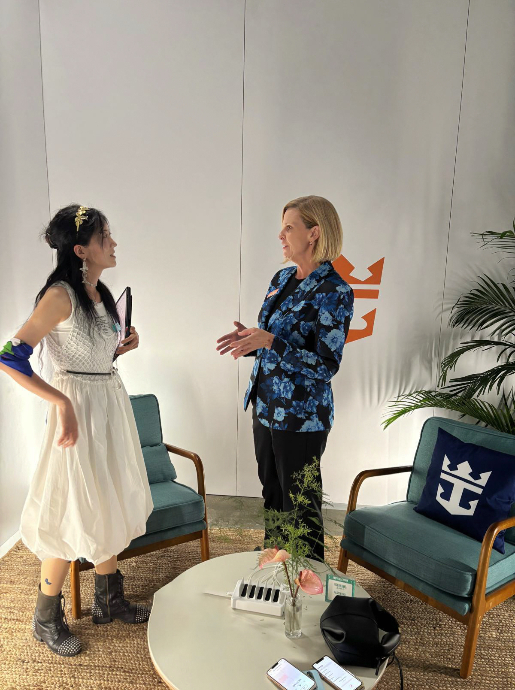

**Q4. 皇家加勒比目前全球部署了多少艘船？亚洲市场的航线服务有哪些在地化特点？**

**A：**
目前我们在全球旗下有28艘游轮（另有4艘在建），覆盖中国、新加坡、澳大利亚、日本、欧洲、中东等多个市场。

在亚洲区域的航线中，我们特别提供中文语言服务、亚洲风味餐饮以及本地化娱乐内容，确保旅客在享受国际标准的同时，也能感受到熟悉的文化体验。

我们发现，中国旅客具有非常强的好奇心与探索欲，他们愿意去尝试最新、最大的产品，也很重视旅途中的细节体验与家庭仪式感。

**Q5. 听说您曾在中国生活过，对中国市场一定有非常深的理解和感情吧？**

**A：**
是的，我曾在上海工作生活一年半，那是在我去新加坡常驻之前的经历。

我的三个男孩子当时也一起生活在中国，他们小时候学了中文，现在还会讲。

亚洲，尤其是中国，是我特别热爱的市场。
它充满活力、热情、潜力无限。

希望未来能有更多的合作和交流，也欢迎你把我们的故事写给更多中国的旅客与家庭。

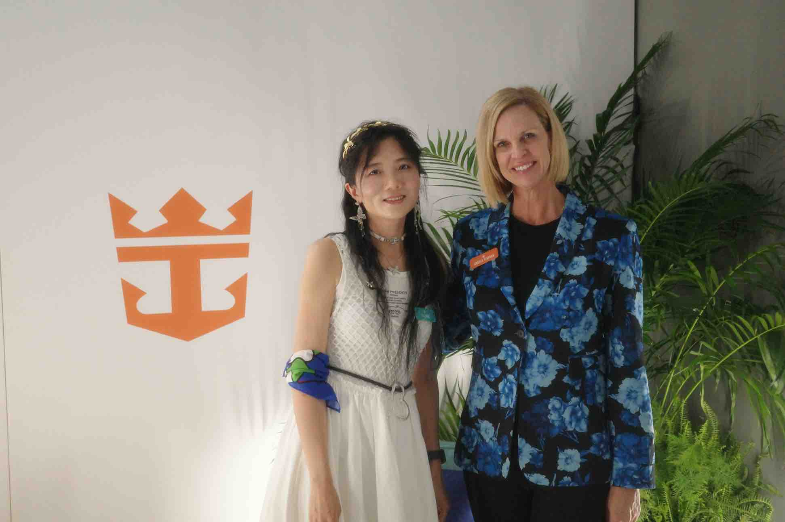

**多代同游**

“多代同游”（multi-generational travel）是这场发布会上被多次强调的关键词。

在皇家加勒比的度假逻辑里，家庭从不是“其中一种客群”，而是整个系统的出发点。

他们注意到，越来越多的家庭不再满足于“各玩各的”，而是想真正一起，经历一段难忘的、完整的假期。

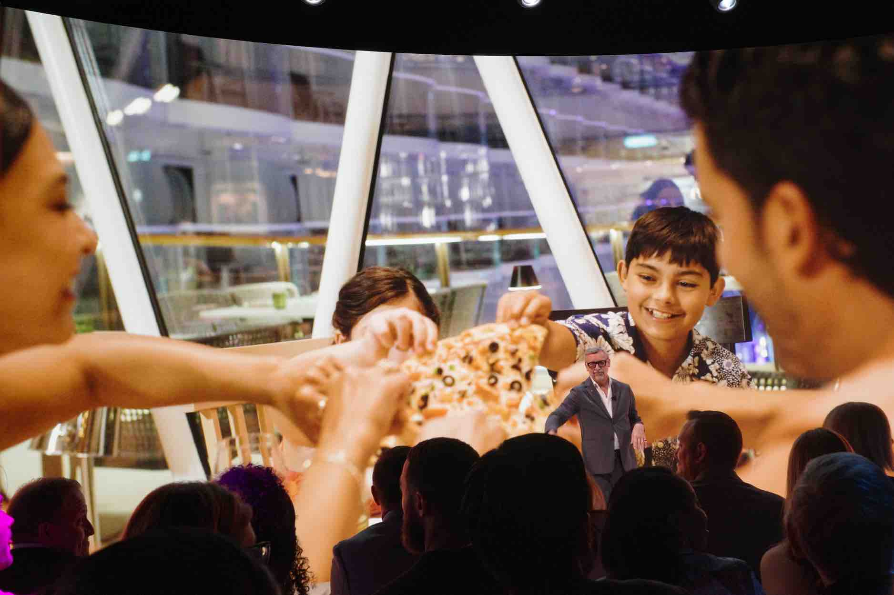

这不是把每个人都带上船，而是让每个人在旅途中都能拥有属于自己的那份体验。

如今，这种理念也被带到了“完美假日·墨西哥站”的岸上设计之中。

更重要的是，这种体验并不止于船上，还有推动目的地、岸上游览乃至会员系统之间的深度联动，期望以更高品质的旅程与服务，让家庭之间的连接感真正延续整个假期旅程，甚至成为记忆中某一代人的“成长坐标”。

他们在构建一种可以被信任、可以被共用、可以被传承的生活片段。

对皇家加勒比来说，真正值得被记住的度假，不是刺激项目的数量，而是这趟旅程是否成为一家人的共同记忆。

**未来 FUTURE**

不只是登岛，而一种生活方式的开启：

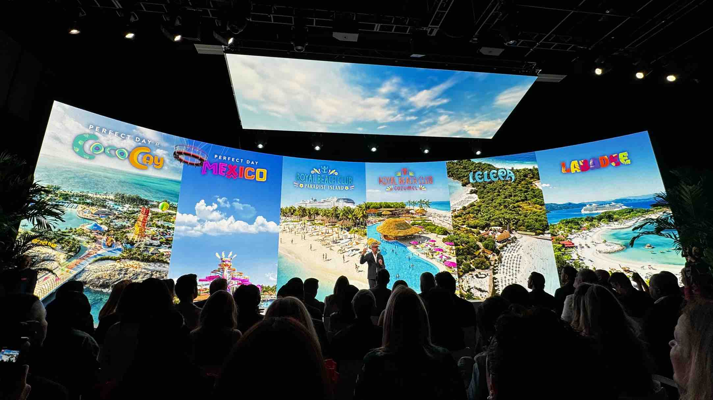

**Royal Beach Club 系列**

“完美假日·墨西哥站”之后，皇家加勒比的未来已悄然展开。

正如迈克·贝勒（Michael Bayley）所说：

> “在接下来的四年里，我们将推出史上最令人期待的一系列目的地体验。”

除了墨西哥，他们正在同步开发三座全新岛屿。

它不再是传统意义上的“上岸体验”，而是在构建一种更长线、更深度的目的地生活方式。

现在，让我们从这三座岛屿开始，进入他们未来度假的另一张蓝图。

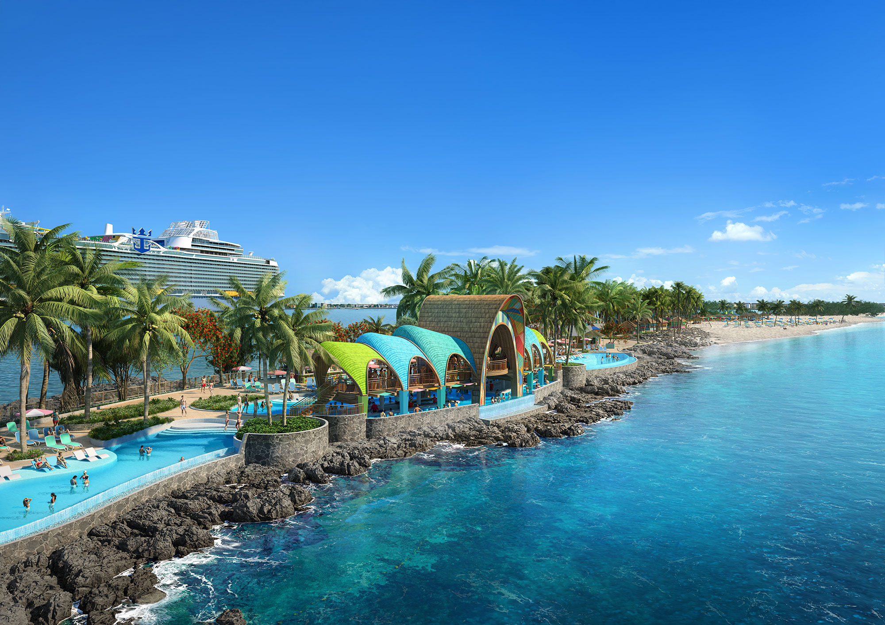

**Club**

他们公布了三座岛屿。

三种节奏，三种海岸线，三个未来的旅行入口。

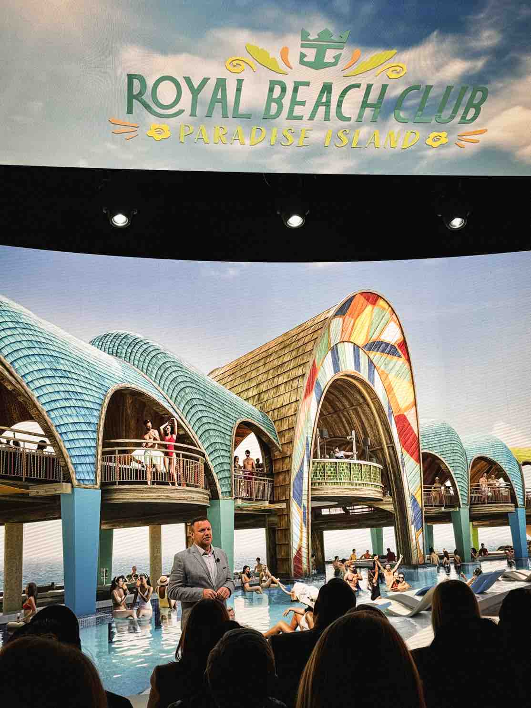

Paradise Island，在巴哈马，是皇家加勒比第一座“皇家海滩俱乐部”。

他们把全球最大的漂浮泳池酒吧建在这里，叫“The Floating Flamingo”。

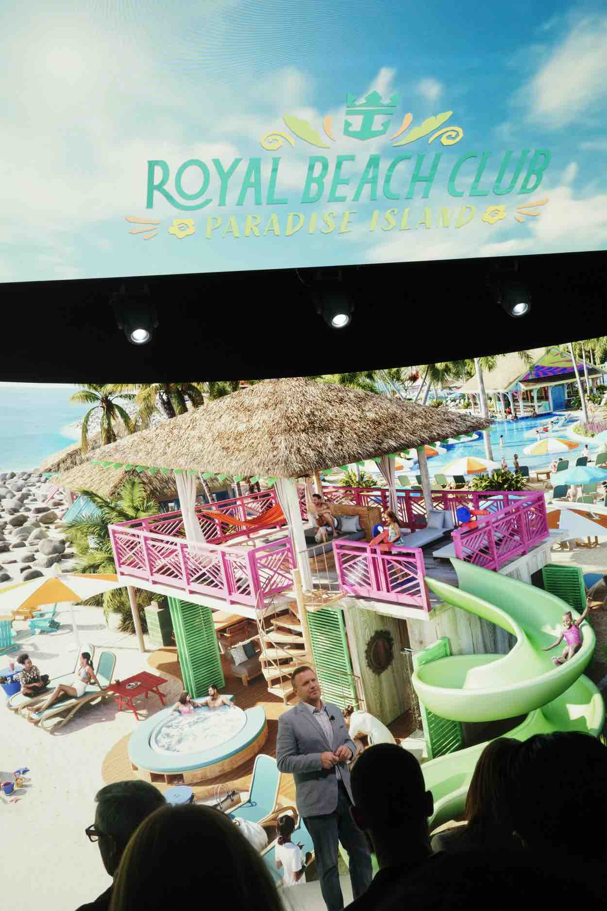

还有三家本地风味的岛屿餐厅、艺术装置、手工艺品、现场音乐。

真正做到了将巴哈马的在地文化揉进度假体验中，是真正与当地团队一起合作完成的本地化试验。

宾客购买日间通行证即可进入，这座岛，已经开始倒计时。
正式开放时间：2025年12月。

第二个俱乐部，在科苏梅尔。

墨西哥最有灵魂的岛屿之一。

是墨西哥文化与加勒比度假精神的融合，
强调色彩、建筑细节与饮食的在地化。

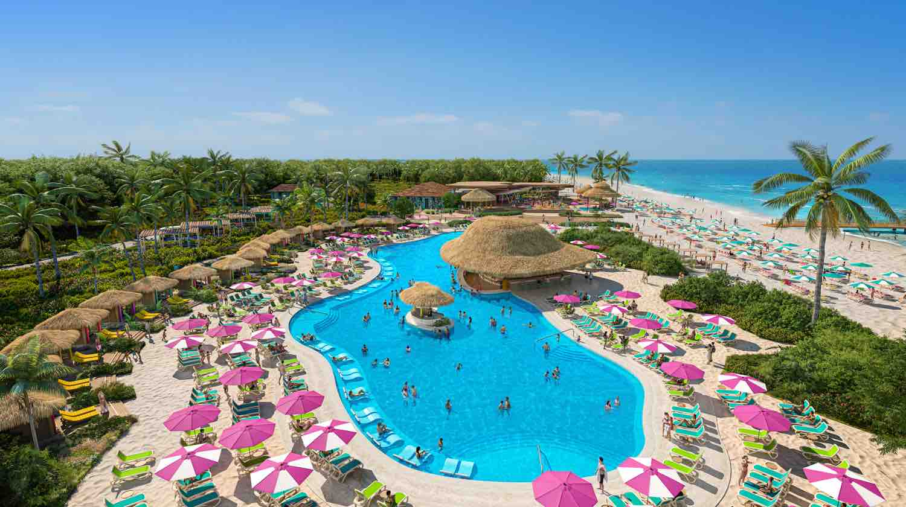

街头市集、烹饪教室、龙舌兰品鉴。

海滩、泳池、小屋、水上酒吧。

一切都包裹在颜色和香气之中，不高声喧哗，但永远热烈。

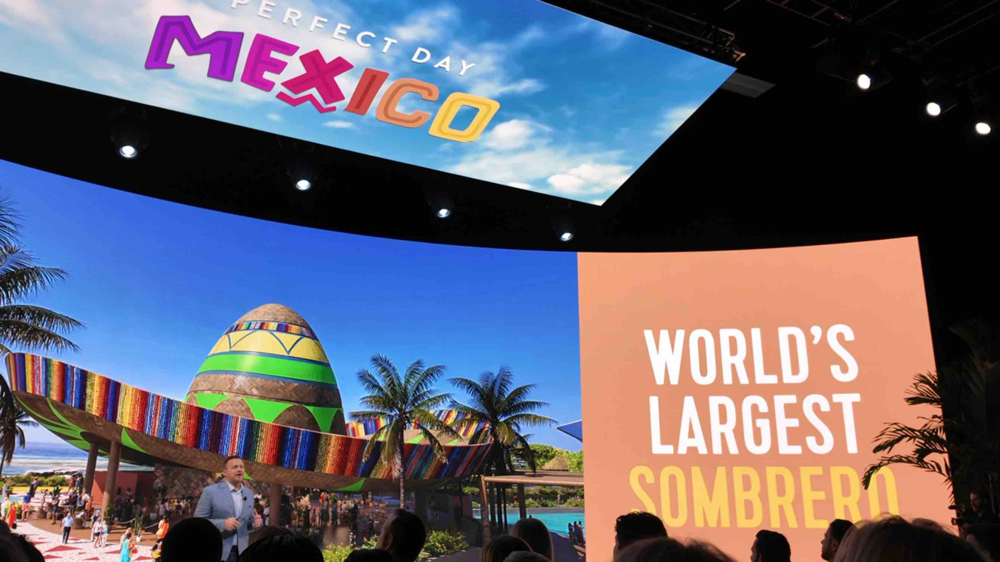

Jay 说：“我们甚至挑战了餐饮团队，要他们做出全球最好喝的玛格丽塔。”
他们的答案，是一个“墨西哥玩具 × 酒杯 × 酒吧”的混合体，形状奇特，结构惊艳。

而在它旁边，皇家加勒比又造出一个20米高、由墨西哥艺术家设计的巨型结构：The Tipsy Sombrero（微醺的墨西哥大草帽），既是地标，也是派对核心。

将于2026年开放，皇家加勒比自己也说，这是一个“与宾客共创”的作品。
正式开放时间：2026年。

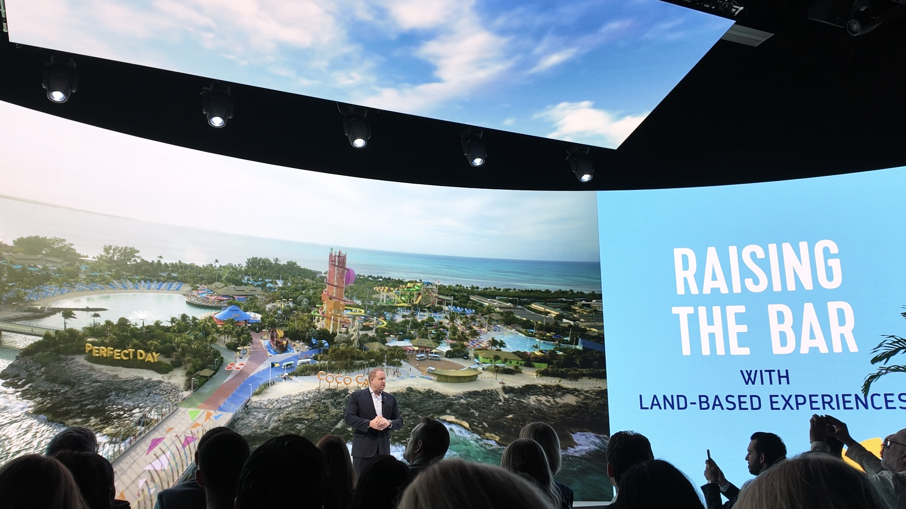

第三站，是Lelepa岛。

南太平洋瓦努阿图群岛里的一座天然小岛。

这是南半球第一个专属游轮目的地。

这站最具有自然情怀，会“尊重土地与传统”，
内容包括自然步道、水上活动、手工艺市集、本地风味餐饮等，呈现出当地文化与自然生态的地道天然，让土地自己说话。

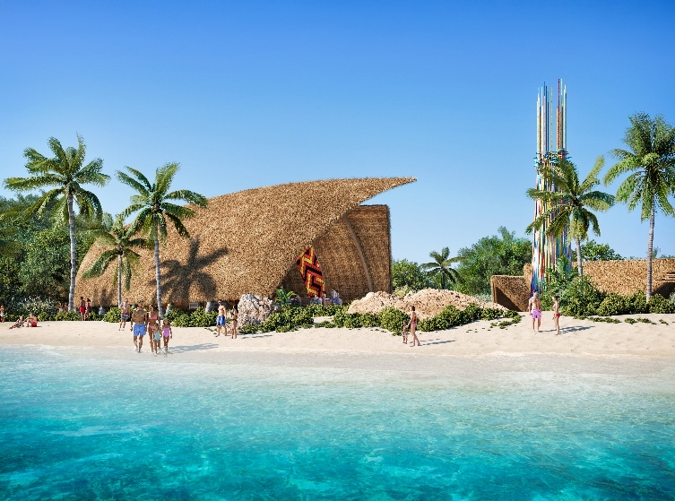

开放时间：2027年初。

他们用三座岛，把岸上体验分成了三种方向：

文化共创、感官沉浸、节奏留白。

不是“新加了三个点”，而是在建一个更完整的旅行生态。

不是多三个地方，而是多了三种“值得停下来”的理由。

到2027年，90%的加勒比航线宾客，都将踏上一个“完美假期”的专属目的地。

从巴哈马，到墨西哥，到南太平洋，这不再只是航程的中转点，而是旅程真正的情感锚点。

**ICON.**

Royal Caribbean 正在改写行业天花板。

2024年1月，皇家加勒比发布旗下首艘 Icon 级游轮 **Icon of the Seas**，

正式亮相，刷新纪录，成为全球最大的游轮——

这艘船上，

有六条全球最快、最高的海上滑水道；

七座风格迥异的泳池；

超过40家餐厅与酒吧，覆盖各种口味与社交需求。

20层甲板、2805间客舱、可容纳7600名宾客，开创了全龄游轮度假的新纪元。

它的空间被规划为多个“主题邻里单元”，
每个区域都围绕不同年龄层与兴趣点打造。

你可以冲进派对，也可以安静观海，
每个人都能找到属于自己的节奏。

如果说“完美假日”是目的地的重构，
那么“海洋标志号”，就是船本身的重写。

从设计之初，它就是为家庭而造的。
不是简单接纳三代同堂，而是真正服务每一代人。

皇家加勒比称它为“全龄度假平台”。

现场公布的数据直接印证了这一点：
“海洋标志号”的顾客满意度和净推荐值（NPS）远超预期，达到了近乎现象级的热潮。

而它的下一位“姊妹船”已经准备启航。

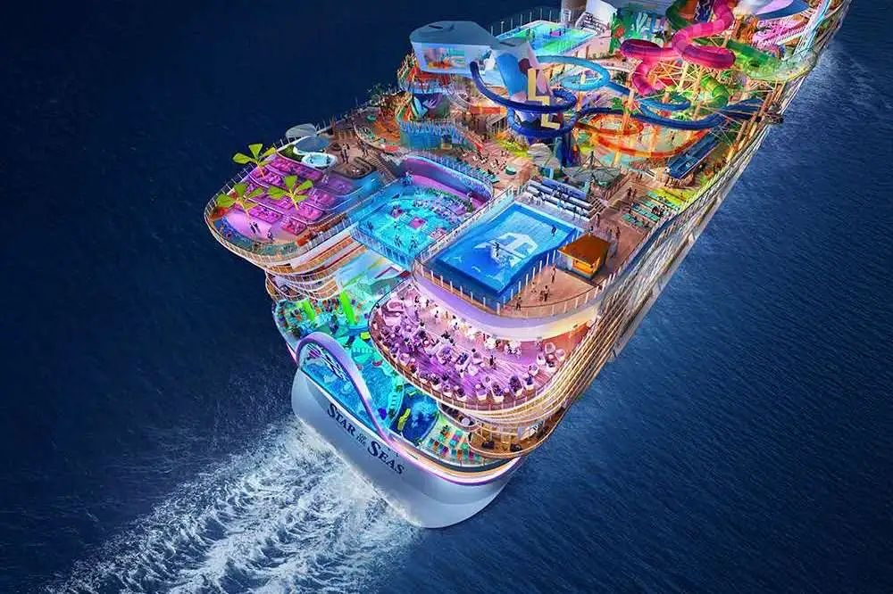

Star of the Seas（海洋之星号）将于今年8月首航，
从卡纳维拉尔港出发，展开7晚的加勒比海旅程。

它延续了“标志号”的设计理念，并在多个体验模块上进行升级。

包括它在内，皇家加勒比还有四艘新船正在建造，
其中包括另一艘“标志级”船只和计划于2026年发布的“海洋标志号”。

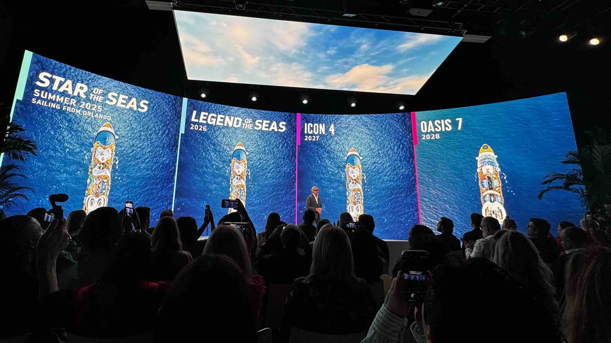

这是一整条游轮技术与体验体系的扩展曲线。

而它与未来四个全新目的地的同步开发，
意味着未来的假期，不止一次“出发”，而是一整套持续演进的旅程。

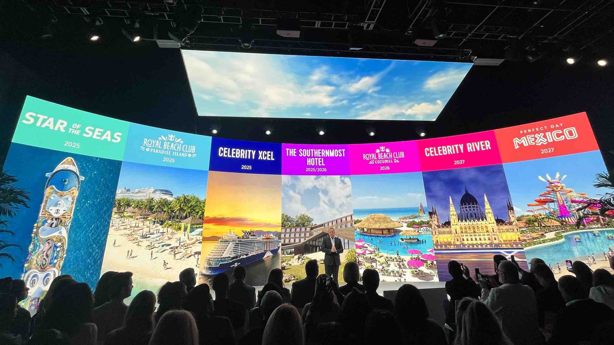

当我们在现场看见这些令人惊叹 of 游轮影像，

听到这些激动人心 of 目的地的故事，

都被皇家加勒比的精神和产品所震撼。

**Dreams. Made Real.（梦想，被实现）**

这当然需要一支卓越的团队。
需要的是一群全球最顶尖的梦想家、创新者与船员，每一天都在付诸实践，才让它们真正被实现。

这些惊艳的创意与体验，背后是一整支相信“没有不可能”的团队，

皇家加勒比首席产品创新官 Jay Schneider 说：
> “有时我们疯狂到超越现实，但正因为这份不设限的热情，才让那些原本不可能的体验，一个个成为现实。”

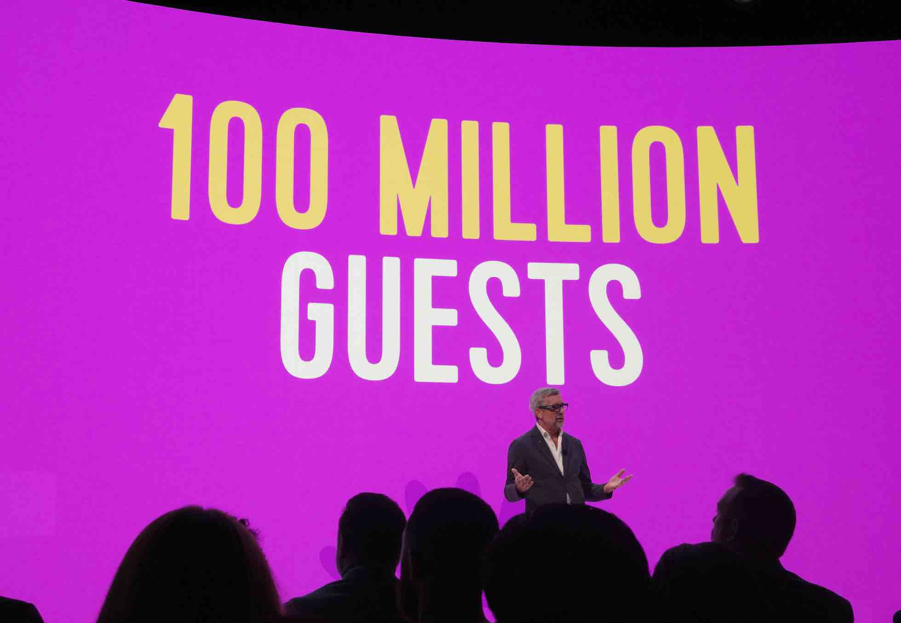

**Beyond the Dream.（不只是梦想）**

皇家加勒比的调研显示，“物有所值”（Value for money）是旅客在反馈中提及频率最高的词汇。

但“物有所值”并不意味着“便宜”，
而是代表他们希望在假期中获得尽可能丰富且高质量的体验。

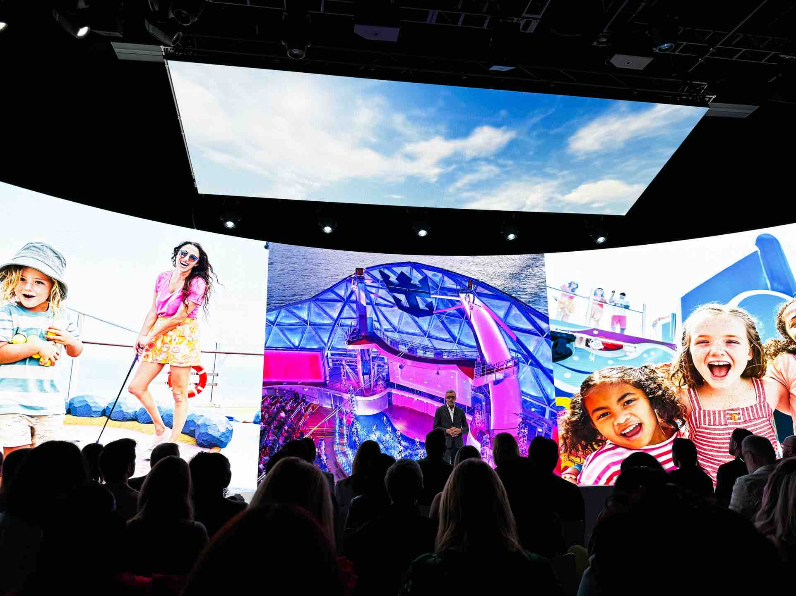

他们希望在每天的旅程中，为宾客持续创造巨大价值。

这些专属目的地也正是为了回应这样的期望而设。
宾客将能在其中，享受多样的活动组合，以及高水准的设施与服务。

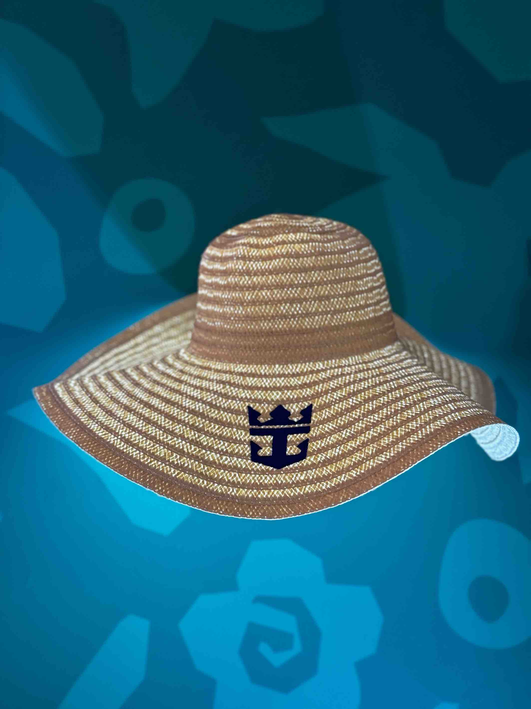

**尾声：度假方式的未来，正在被重新定义**

在皇家加勒比看来，每一个目的地，不只是一个地理坐标，更是一种情感的投射——
它应当带来“不同、独特、难忘”的度假记忆。

“完美假期·墨西哥站”的诞生，
不仅在规模、设计与体验上刷新了行业标准，
也将“共享时光、创造回忆”这一幸福感核心，融入每一个细节。

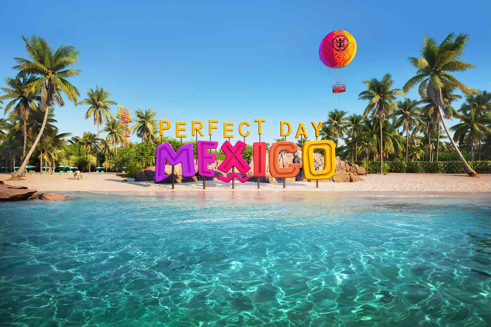

正如发布会所呈现的那样，

他们追求的，从来不是项目的堆砌，

而是服务的融合、文化的共鸣，

以及那些最终被铭记的瞬间。

而我作为一名旅行媒体人，
确实感受到：这不只是一次发布会，
而是一场针对“未来度假方式”的预演。

那晚的活动只是展现了冰山一角，
更多惊喜尚在保密阶段，
只为在真正迎宾的那一刻，
送上一场震撼人心的盛宴。

据悉，“墨西哥完美假期”将于 2027 年秋季正式开放，
未来将成为东加勒比与西加勒比航线的重要一站。

而涵盖该目的地的精选航程，也将在今年秋季开放预订。

这一切尚未抵达，
但一座岛屿的生活方式，已经提前在纽约登场——
而心，已经启程。

**关于皇家加勒比国际游轮**

皇家加勒比国际游轮隶属于皇家加勒比集团（纽约证券交易所股票代码：RCL），在过去的50多年里通过创新不断为宾客带来难忘的度假体验。

作为全球游轮行业的先锋品牌，皇家加勒比以划时代的游轮与专属目的地重新定义海上度假体验，融合刺激冒险、精致餐饮、精彩娱乐等多样化元素，为不同类型的家庭与旅行者打造专属假期。

皇家加勒比连续22年荣获 Travel Weekly 读者选择奖“最佳游轮公司”称号。

如今，皇家加勒比的航线覆盖全球七大洲80个国家的300多个目的地，其中包括广受赞誉的“完美假日系列”专属目的地——如巴哈马的“可可岛完美假日”。

---

**版权与图片来源说明**

本篇特稿所使用的图片、视觉设计概念图、专访引言以及相关技术与目的地规划等核心内容与数据资料，均由**皇家加勒比国际游轮官方**授权提供。