# We Wandered the Streets of Beijing Visiting 30 Cafes — Here They Are in One Minute

*Geng Yue · Brand Stories*

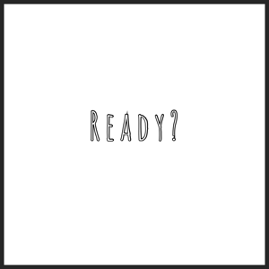

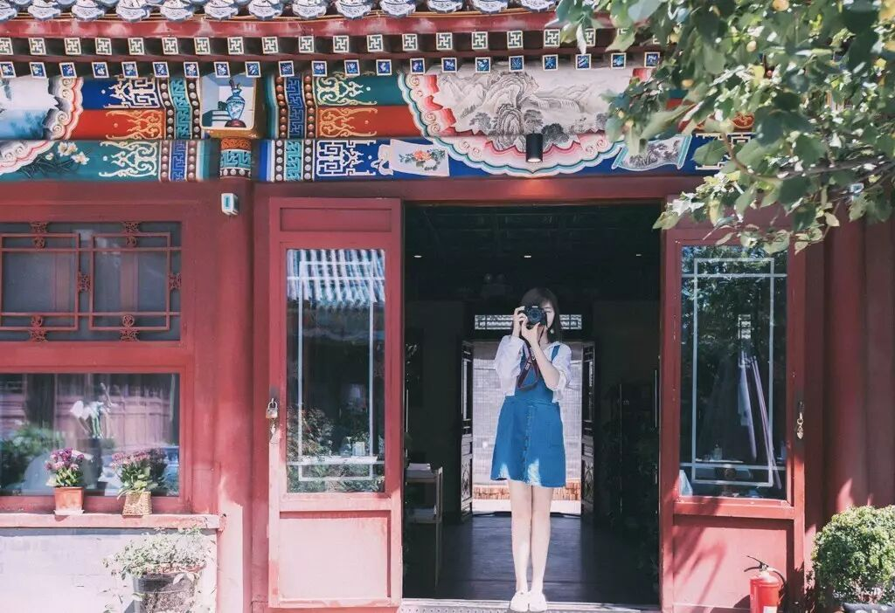

I love coffee. Whenever I travel to any city in the world, I always make sure to luxuriously "waste" an afternoon in a cafe.

After returning to Beijing from my travels in Europe, I spent a few short months pondering one question: **How to travel in your own city.**

Like you, before I **became a professional traveler, I yearned desperately for faraway places**. Human nature is fickle — it's easy to lose a sense of freshness toward the city you've lived in for so long.

For those who work in big cities — stuck in taxis through endless red lights, squeezed into subways among numb faces, ordering the same takeout every day, going to the same restaurants and shops, walking the same familiar road home, living the same three-point-one-line 9-to-5 routine — the longing to see a bigger world beyond is overwhelming.

But actually, there is **a bigger world** right beside you.

This time, we wandered the streets and alleys, visiting 30 cafes across Beijing, condensed into one minute.

This video isn't just about recommending coffee shops. It's about what we set out to do with our city guides from the very beginning:

**To make your life feel like a journey — so that wherever you are, you can find poetry and distant horizons right around the corner.**

Every cafe has its own distinct character.

Here are **4** to start with:

**1 |** C5 Cafe

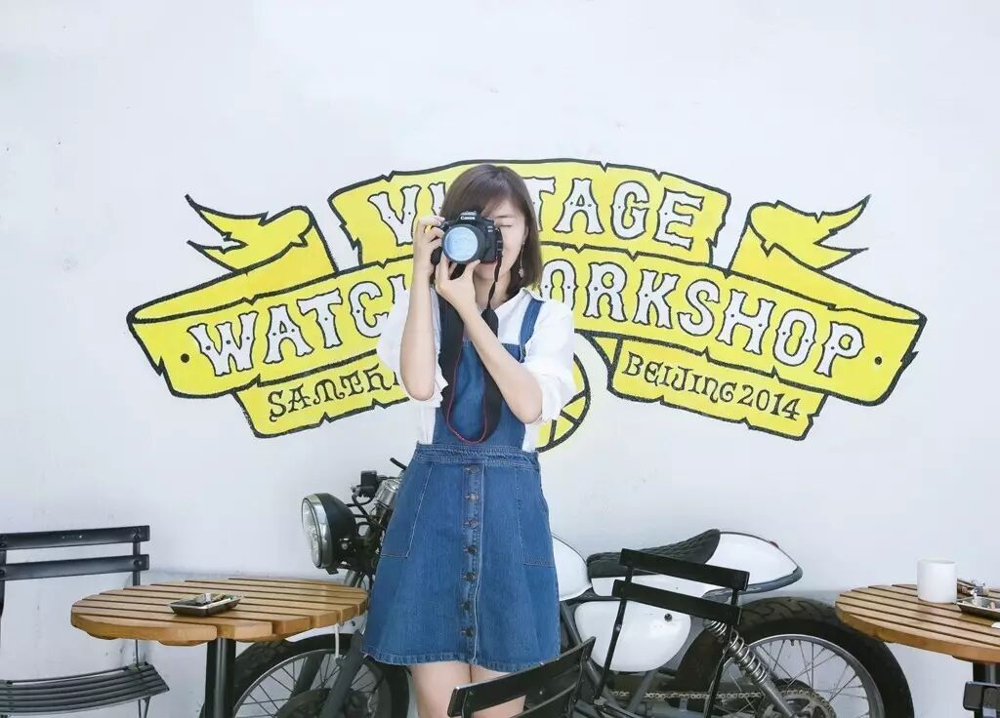

C5 is the most hidden cafe I've discovered. It magically shuts out the noise of the Sanlitun neighborhood.

My first visit was with my good friend Yoyo. I went back twice more on my own. **Ordering a hand-drip Guatemalan, served in a beautiful vessel, with a banana pancake topped with berries — the pancake soft and fluffy, still warm from the pan — it was absolutely delicious.**

You can quietly write alone, or discuss work in hushed tones with a friend. **Either way, it's so comfortable to just be there.**

Turning around, you see the pure white courtyard, the lush greenery gleaming in the sunlight. Beijing's skies have been so blue lately. One time I sat until dusk, watching the sunset spill through the glass ceiling — a perfect moment to quietly drift off into a beautiful daydream.

🏠 Address: C5 Art Center, 5 Xiwu Street, Sanlitun, Chaoyang District, Beijing

🕙 Hours: Mon–Fri 10:00–19:00, Sat–Sun 10:00–20:30

**2 |** Hours of Light (Duorou)

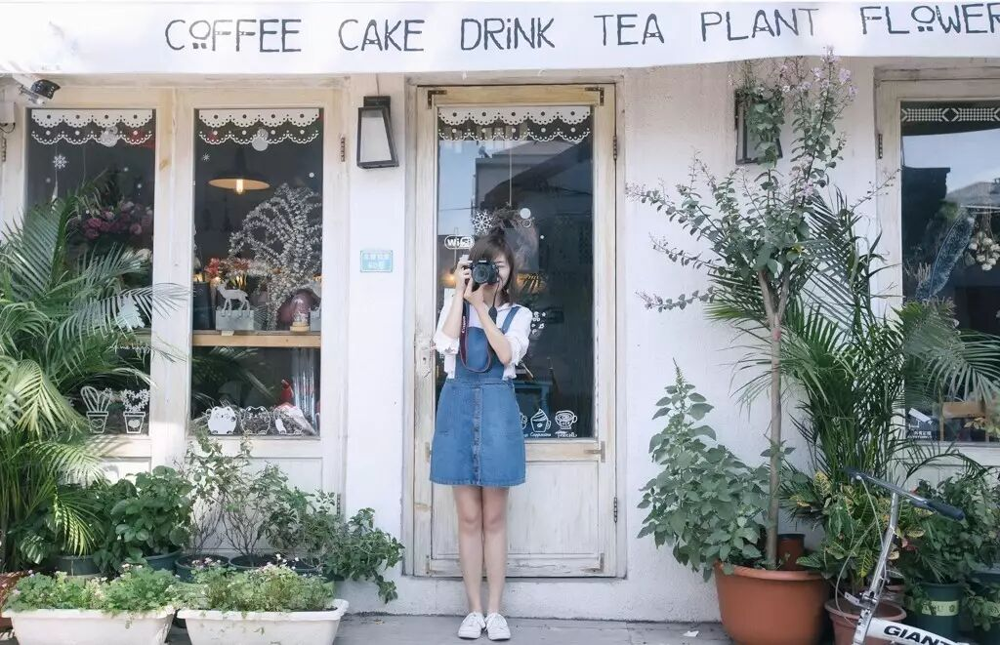

Beijing's early autumn is the most comfortable season of the year. In a slow-paced little shop, looking at plants and flowers, playing with cats, having afternoon tea with close friends — these are rare, luxurious moments.

Hours of Light has both a cat branch and a dog branch. **Many people love its open-air sun terrace, filled with beautiful succulents, fresh flowers, and a short-legged corgi — deeply healing.**

There are three Hours of Light locations on Beiluoguxiang, but this one is the prettiest. Its fresh, clean aesthetic gave me the feeling of finding kindred spirits. There's none of the heavy commercial atmosphere of Nanluoguxiang — you can lazily wander the entire hutong at your leisure.

🏠 Address: 60 Beiluoguxiang (north of the Succulent Museum)

🕙 Hours: 10:00–22:00

**3 |** Voyage Cafe

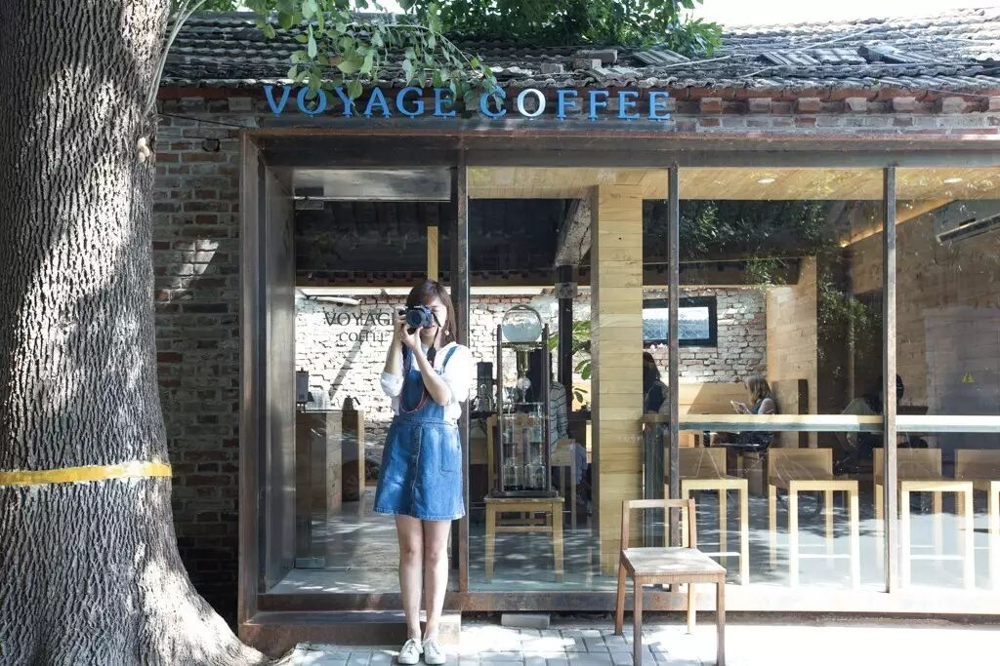

At first glance, the hutong courtyard, wooden beams, grey tiles, red bricks, solid wood tables and chairs, and the big tree by the entrance — it all drew me in.

At second glance, a vast expanse of transparent glass windows, clean lines, strong design — standing outside, I already wanted to sit here for the whole afternoon.

**This is a pure handcraft coffee shop.** "Like a solitary traveler, it tirelessly seeks and gathers the world's finest coffee beans, pouring the utmost care into the craft of coffee." (Xia Liang)

🏠 Address: 80 Beiluoguxiang, Dongcheng District

🕙 Hours: Mon–Sun 10:00–22:00

**4 |** Real Coffee

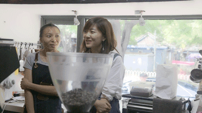

We had been filming all day. By the time we reached Old Gulou Street, it was already evening, and I was craving a cup of coffee.

That's how we stumbled upon Real. What a delight.

**The moment I took that first sip of Freestyle coffee, I knew I was a goner.**

Barista Mumu and her cat Fafa were utterly adorable. We chatted like old friends, warm and familiar. Here, I bought a bag of beans and shot our first-ever food video, documenting the entire handcrafted process — from grinding, distributing, tamping, to extraction and blending. If you're a true coffee enthusiast, Real is absolutely worth a visit.

🏠 Address: 12 Tanggong Hutong, Dongcheng District (street-facing, Old Gulou Street)

🕙 Hours: 11:00–21:30

**Hutong Coffee Map**

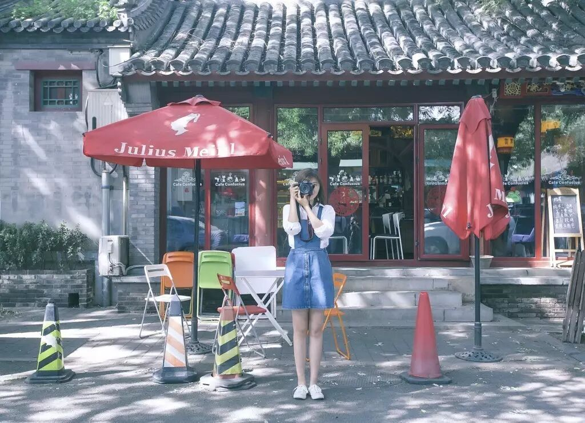

Beyond the four I've written about, **every cafe in the video has its own unique little universe** — with delicious desserts and drinks.

The craft wheat beer at Faith Cafe, the durian cheesecake at Milk Powder Coffee, the "Fuji Mountain" coffee on the signboard at Such A Cafe — all too tempting. You need to go there specially, sit down, and savor them slowly.

From Old Gulou Street to Wudaoying Hutong, from Yonghegong Street to Jiaodaokou...

Most are tucked into hutongs, woven into the daily life of Beijingers. A few good shops have already closed, or will soon close.

As we filmed, we couldn't help but sigh: **Can the small and beautiful things in this world hold on just a little longer?**

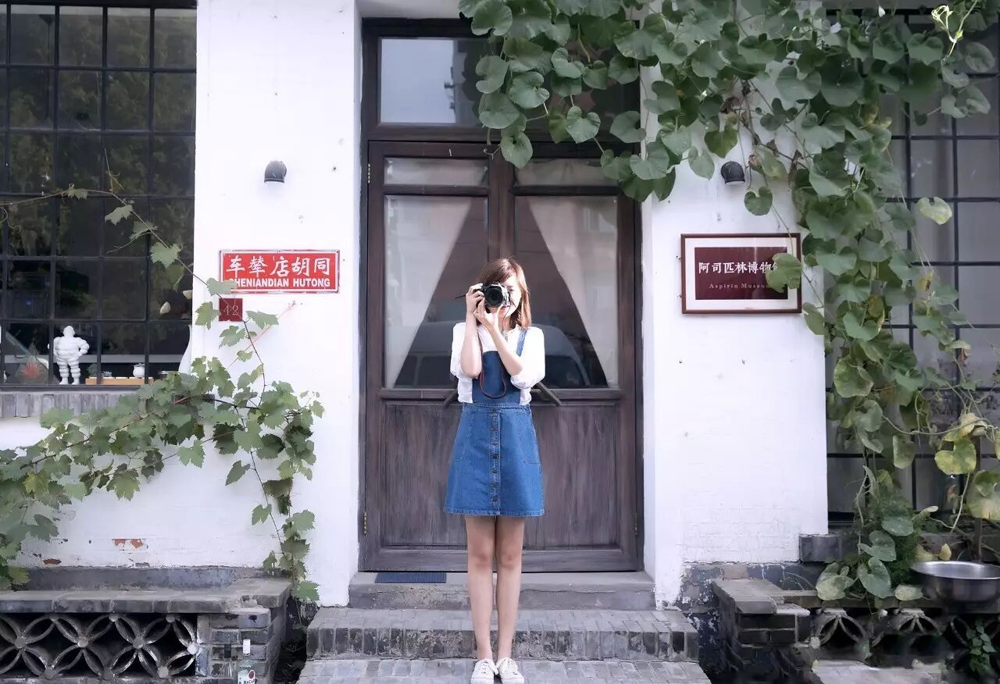

-

(Photo: Aspirin Museum Cafe)

**WHY COFFEE**

Before uploading this video, I took a moment to reflect: What does coffee mean in my life? **Why do I love coffee?**

**1. Drinking coffee is the one thing I've persisted with the longest — and it barely requires any persistence at all.**

Drinking coffee every day — this is one of the few things I've consistently kept up in this world, and it's almost the one thing that requires no effort to sustain.

**2. A morning ritual. I only feel truly awake after a cup of black coffee in the morning.**

Without coffee, I'm sluggish and drowsy all day. After drinking it, the morning feels especially beautiful, my mind is especially clear. I can start working.

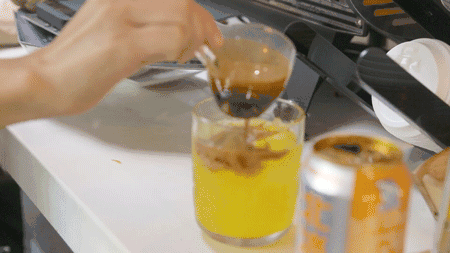

**3. A traveler's way of exploring a city.**

For a traveler in a foreign land, a cup of coffee is a way to understand the city's way of life — **to see the true face of how the city lives, which speaks to the local spirit far more than aimless wandering ever could.** And the people in cafes are always better-looking, too.

**4. Everything wonderful begins here.**

Midway through writing this essay, I put down my pen, went to a cafe to meet a friend, and came back to continue writing.

Countless times, my meetings with friends in this city have happened in cafes — chatting, discussing things, talking about life, sharing gossip... **If coffee had ears, it would know more secrets than anything else in the world.**

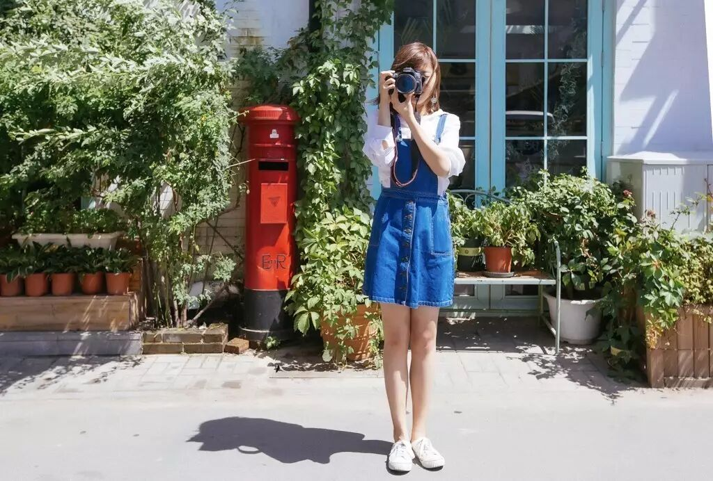

**If I'm not in a cafe, I'm on my way to one.**

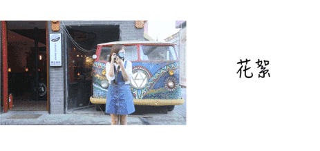

This is a little behind-the-scenes clip from the video — me, swallowed up in a sea of elderly uncles and aunties, delivery guys, and cyclists. The truth behind the idyllic aesthetic, haha.

*How, from the ordinary, everyday life*

*in familiar places,*

*do you find something truly special?*

*To become interested in your own city*

*might be the more impressive thing.*

*For now, stop chasing chance encounters ten thousand miles away.*

*In the streets and alleys of the city you live in,*

**go out again, explore, travel.**

*There are so many surprises you've been overlooking.*

**In old places, find new scenery. This video series continues.**

♥

**Thank you for still looking forward to my travel stories.**

