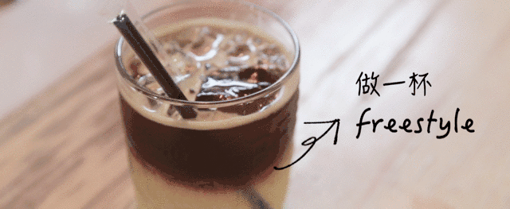
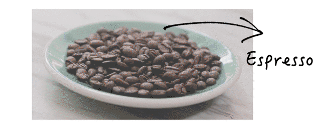
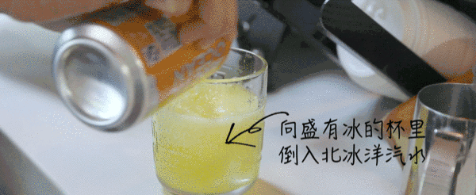
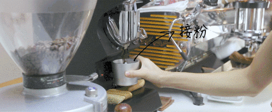
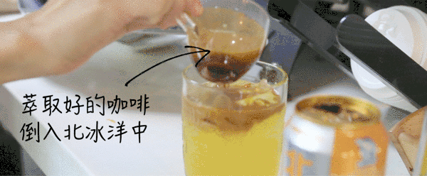
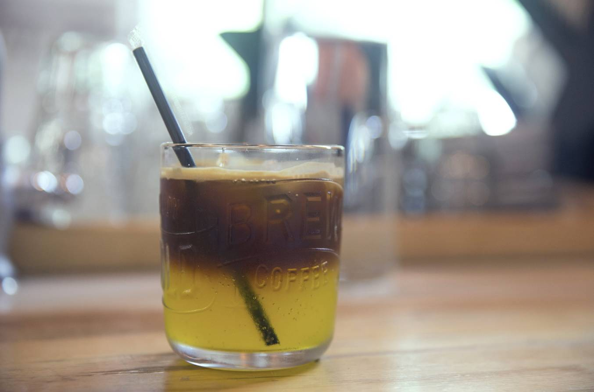

# Don't Go, Homie — I've Got a Freestyle Iced Coffee for You!

*Geng Yue · Brand Stories*

yo yo hey yo — tonight we're all hip-hop homies~

Sit down, have a Freestyle, drop a rap

yo yo hey yo — tonight we're all hip-hop homies~

This is the coffee that turned a travel blogger into a food video creator.

Here's the story:

Wen Yi and I were filming Beijing's 30 cafes. The weather was dry and hot.

We needed a coffee. We wandered into a cafe near the Drum Tower called **Real**.

Since we were both watching *The Rap of China*, we didn't hesitate — we ordered a **Freestyle**.

And after that first sip, we were absolutely hooked.

Over the next two days, we went back three times. A cup first thing in the morning. Another after filming at night. Even after getting home, we were still craving more (couldn't stop 😂).

👇

**How to Make a Freestyle Coffee**

This was our first-ever food video — and it felt like opening a new universe. A little addictive.

Crack open a bottle of Arctic Ocean soda — the taste of old Beijing memory — grab a handful of coffee beans, and you can freely whip up a refreshing iced coffee. It's simple to make, and after drinking it, you feel completely refreshed.

☕️

**Ingredients: 1 can of Arctic Ocean soda + 1 handful of coffee beans + plenty of ice**

Arctic Ocean soda — a taste of old Beijing, orange-flavored.

Your favorite coffee beans. In this video, we used Espresso — a bold, intense style of coffee.

Ice! Ice! Ice! (This is the key to success.) You need one large block of ice and a whole lot of crushed ice.

Equipment: Espresso machine (or a home moka pot works too); a glass cup.

**Step 1** Put all the ice into the glass. Pour the Arctic Ocean soda into the ice-filled glass, filling it about 4/5 of the way.

**Step 2** Grind the coffee beans into powder. If using an espresso machine:

The steps are: dose — distribute — tamp — extract. If using a moka pot at home, you can skip the tamping step.

**Step 3** Slowly pour the brewed coffee into the glass with the Arctic Ocean soda. You'll see a beautiful layered effect.

**Step 4** A simple, refreshing Freestyle coffee — done.

**You can also try: soda water / cola / a scoop of ice cream / beer / lemon tea / fruit juice**

Anything is possible.

It's seriously so much fun.

If you nail it, share it with me on Weibo @摄影师耿悦 — let's celebrate together, haha.

