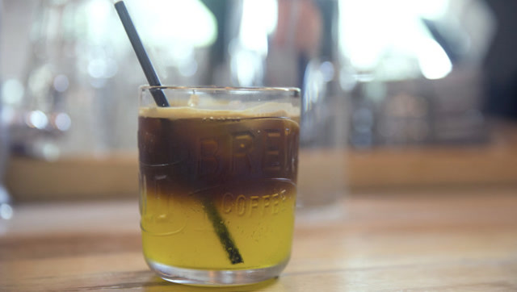

# How to Make a Summer Freestyle Iced Coffee

*Geng Yue · Brand Stories*

This is a video episode on how to make a Freestyle iced coffee.

Summer, ice, Arctic Ocean soda, coffee — put these keywords together and you have a refreshing, delightfully playful homemade iced coffee.

Crack open a bottle of Arctic Ocean soda — that taste of old Beijing memory — grab a handful of your favorite coffee beans, and you can freely create a summer Freestyle that is entirely your own.

Dead simple. After drinking it, you'll feel completely refreshed.

Give it a try. You can do it too.