# 我的旅行双肩包 · Herschel Supply

走了几十个城市的背包

---
之前貌似写过背包的，来这发一下。我在旅途中背着这个双肩背包，走了几十个城市， 当你看到问题时，可以根据你的需求，喜好，挑选当季背包里，你喜欢的新款式， 比如，最近我想整个Patag onia的双肩背包。

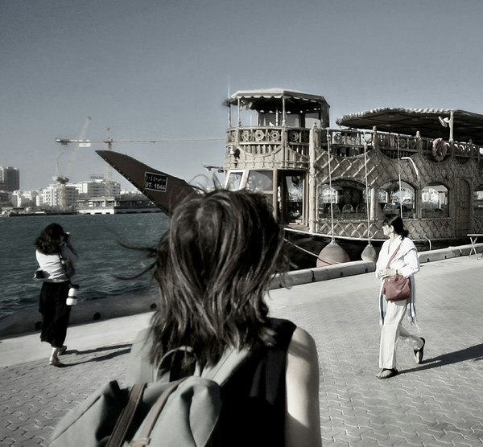

在迪拜 这个背包已经算是我的一个回忆吧， 型号是#Herschelsup ply 8167738男款双肩包中号。 是有次出差在旧金山逛街时买的，朋友帮选的颜色，价格当时只有国内一半，大概700块不到吧。 喜欢的缘由如下：

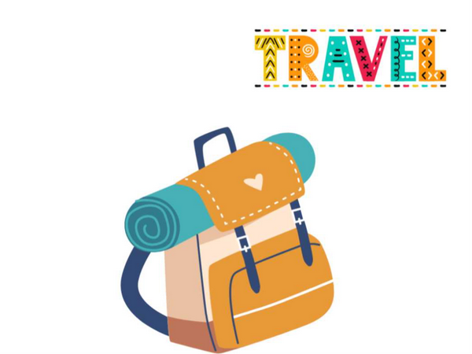

有眼缘，颜色款式，军绿色 好搭配，也符合我性格。 功能实用，同时百搭。

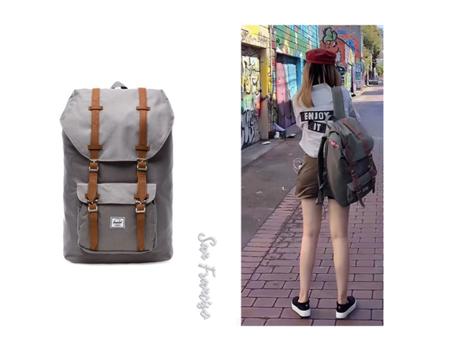

在旧金山 2. 能装，比较大。 买的男款的25升容量，Vans 25。 可以往里面丢很多东西，像个桶一样。

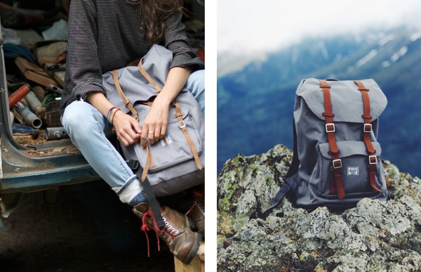

3. 肩带厚实，背后有减重量的海绵。 如果只是旅行者，那可以轻装上阵。如果想边走边拍，去的地方很丰富，背包里装着设备，水，创作所需。如果是 数字游民，也许还要需要电脑和充电设备。 重量不会轻，但厚实的肩带和减震，感觉能减轻三分之一的重量，背着走一天都还o k。

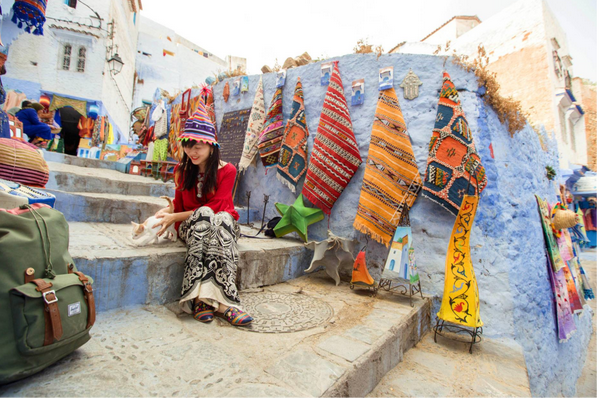

在摩洛哥 4. 隔层：比较厚的绒面隔层，隔层当时放15寸Mac P ro电脑。电脑裸着放进去也不怕。 甚至经常放各种便携的相机和镜头，外面有缓冲包装就行。 现在新款侧袋可以直接取电池，和耳机。 5. 内衬是这个品牌标志性的红白条纹。 抽绳收口，直接拉一下就行了，袋子口一下收得很紧。 6. 因为这个是男款，男生上身的效果：

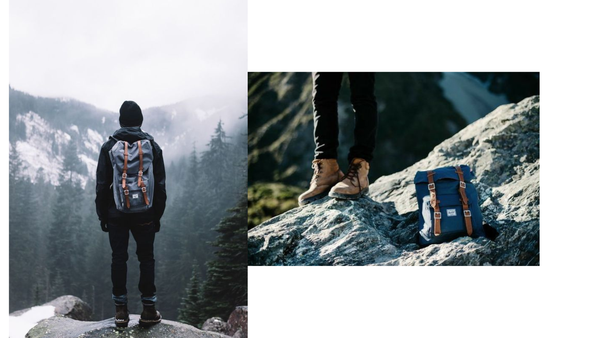

颜色耐脏，黑色的蛮好看的

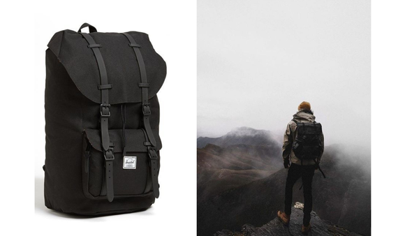

这款颜色附图。

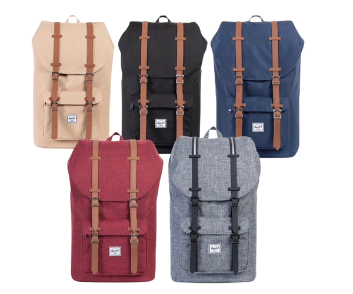

7. 能背这么久主要是舒适实用。也耐造。 奔波完城市山野，回来洗一洗感觉又很新。不容易旧。 不过这些还是以轻便，舒适，好看，实用功能为主。大部分使用场景适合在城市，风景，但那种难度较高的户外徒步， 就需要专业设备，或者背包可以拓展，可以加睡袋等。

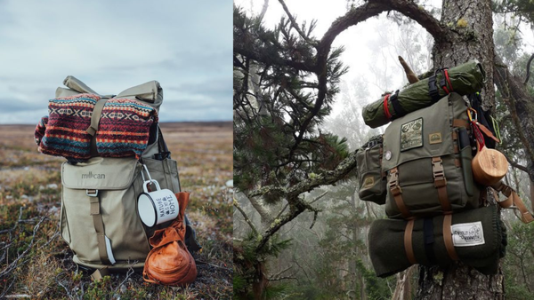

其实大部分双肩包，质量比较好，拉链不容易开，里面有分层，日常旅游应该都o k。

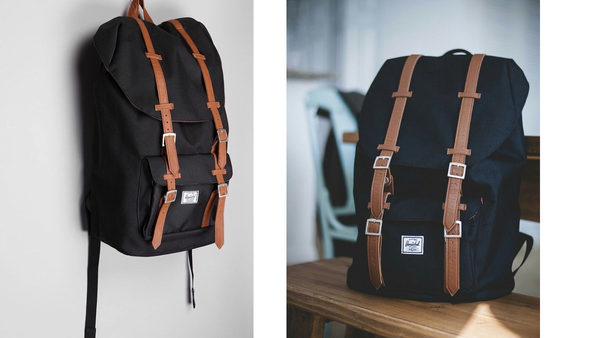

我之前给我爸妈的两个包，也都挺好用的，书包旅行也好背。 在买这个之前我收藏的款

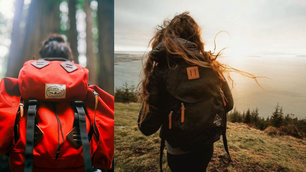

另外除了双肩包，还有专业的放相机的拉杆包，还有行李箱之类的，可以各自发挥功能。 这个是之前写过的推荐，发在这吧。

---

## 版权

本文为耿悦原创，版权所有。未经许可不得转载或商业使用。
